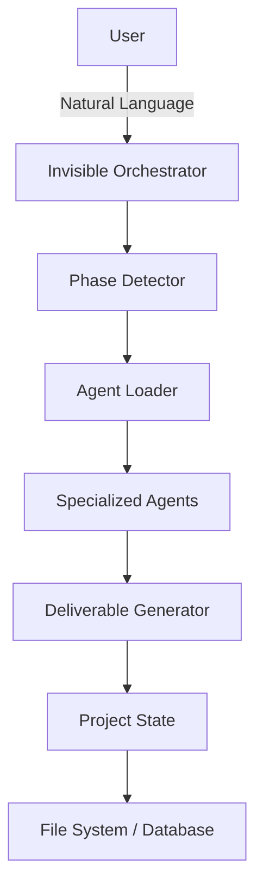

# AiDesigner Code Review and Improvement Recommendations

## Executive Summary

AiDesigner is a well-structured AI agent framework with excellent documentation and a sophisticated architecture. The codebase demonstrates strong engineering practices with comprehensive testing (230/230 tests passing), zero console warnings, and a well-thought-out separation of concerns. This review identifies key areas for enhancement to improve maintainability, scalability, and developer experience.

**Overall Quality Score: 8.5/10**

## Architecture Analysis

### Strengths

1. **Three-Layer Design**: Clear separation between core framework (`aidesigner-core/`), tooling (`tools/`), and distribution (`dist/`) allows for excellent modularity.

2. **Environment Duality**: Supporting both IDE and web environments through the same core assets demonstrates forward-thinking architecture.

3. **Natural Language First**: Using Markdown/YAML for agent definitions keeps the framework accessible and maintainable.

4. **Comprehensive Testing**: 41 test suites with 230 tests covering critical functionality provides confidence in changes.

5. **Structured Logging**: Migration from console warnings to structured logging shows maturity in operational concerns.

6. **MCP Integration**: Model Context Protocol integration enables powerful extensibility.

### Areas for Improvement

#### 1. TypeScript Migration (Priority: High)

**Current State**: Mix of JavaScript and TypeScript with no type safety in core modules.

**Recommendation**: Gradual TypeScript migration starting with core modules:

- `lib/project-state.js` → Types for state management
- `lib/bmad-bridge.js` → Type-safe agent loading
- `bin/aidesigner` → CLI type safety
- `common/utils/assistant-env.js` → Environment variable types

**Benefits**:

- Catch errors at compile time
- Better IDE autocomplete and documentation
- Easier refactoring and maintenance
- Type-safe API contracts

**Implementation**:

```typescript
// Example: lib/project-state.ts
interface ProjectState {
  projectId: string;
  projectName: string | null;
  currentPhase: Phase;
  phaseHistory: PhaseTransition[];
  // ... rest of properties
}

interface PhaseTransition {
  from: Phase;
  to: Phase;
  timestamp: string;
  context: Record<string, unknown>;
}

type Phase = 'analyst' | 'pm' | 'architect' | 'sm' | 'dev' | 'qa';
```

#### 2. API Layer Abstraction (Priority: High)

**Current State**: Direct file system operations and state management scattered throughout codebase.

**Recommendation**: Create abstraction layer for core operations:

```typescript
// lib/api/index.ts
export interface AiDesignerAPI {
  // State management
  state: StateAPI;

  // Agent management
  agents: AgentAPI;

  // Deliverable generation
  deliverables: DeliverableAPI;

  // MCP integration
  mcp: MCPServerAPI;
}

// Usage in frontend
const api = createAiDesignerAPI({
  transport: 'http', // or 'websocket' or 'ipc'
  baseUrl: '/api',
});

await api.state.getCurrentPhase();
await api.agents.loadAgent('pm');
await api.deliverables.generatePRD(context);
```

**Benefits**:

- Frontend can communicate with backend through clean API
- Easy to swap implementations (file system → database)
- Better testability with mock implementations
- Clear contract between layers

#### 3. Event System (Priority: Medium)

**Current State**: No centralized event system for tracking state changes.

**Recommendation**: Implement event emitter pattern:

```typescript
// lib/events.ts
export interface AiDesignerEvents {
  'phase:transition': PhaseTransition;
  'deliverable:created': { type: string; path: string };
  'agent:loaded': { agentId: string };
  'state:updated': Partial<ProjectState>;
}

class AiDesignerEventBus extends EventEmitter<AiDesignerEvents> {}

// Usage
eventBus.on('phase:transition', (transition) => {
  console.log(`Transitioned from ${transition.from} to ${transition.to}`);
  // Update UI, send notifications, etc.
});
```

**Benefits**:

- Real-time UI updates
- Audit logging
- Plugin/extension system
- Debugging and monitoring

#### 4. Error Handling Standardization (Priority: Medium)

**Current State**: Mixed error handling approaches with some try/catch blocks and some error returns.

**Recommendation**: Standardize error handling:

```typescript
// lib/errors.ts
export class AiDesignerError extends Error {
  constructor(
    message: string,
    public code: string,
    public details?: Record<string, unknown>,
  ) {
    super(message);
    this.name = 'AiDesignerError';
  }
}

export class PhaseTransitionError extends AiDesignerError {
  constructor(from: Phase, to: Phase, reason: string) {
    super(`Cannot transition from ${from} to ${to}: ${reason}`, 'PHASE_TRANSITION_ERROR', {
      from,
      to,
      reason,
    });
  }
}

// Usage
try {
  await projectState.transitionPhase('architect', context);
} catch (error) {
  if (error instanceof PhaseTransitionError) {
    // Handle specific error
    logger.error('Phase transition failed', error.details);
  }
  throw error;
}
```

#### 5. Configuration Management (Priority: Medium)

**Current State**: Configuration scattered across multiple files and environment variables.

**Recommendation**: Centralized configuration system:

```typescript
// lib/config.ts
export interface AiDesignerConfig {
  // Paths
  paths: {
    projectRoot: string;
    stateDir: string;
    docsDir: string;
    agentsDir: string;
  };

  // LLM settings
  llm: {
    provider: string;
    model: string;
    apiKey?: string;
    baseUrl?: string;
  };

  // Feature flags
  features: {
    vibeCheck: boolean;
    drawbridge: boolean;
    compoundingEngineering: boolean;
  };
}

export function loadConfig(overrides?: Partial<AiDesignerConfig>): AiDesignerConfig {
  // Load from files, env vars, and merge with defaults
}
```

#### 6. Testing Infrastructure (Priority: Low)

**Current State**: Good test coverage but missing integration tests for end-to-end flows.

**Recommendation**: Add integration test suite:

```javascript
// test/integration/full-workflow.test.js
describe('Full greenfield workflow', () => {
  it('should complete analyst → pm → architect → sm → dev flow', async () => {
    const project = await createTestProject();

    // Analyst phase
    await project.runPhase('analyst', {
      requirements: testRequirements,
    });
    expect(project.getDeliverable('analyst', 'brief')).toBeDefined();

    // PM phase
    await project.transitionPhase('pm');
    await project.runPhase('pm', {
      brief: project.getDeliverable('analyst', 'brief'),
    });
    expect(project.getDeliverable('pm', 'prd')).toBeDefined();

    // ... continue through all phases
  });
});
```

## Code Quality Improvements

### 1. Reduce Code Duplication

**File**: `bin/aidesigner` (2476 lines)

**Issue**: Large monolithic file with multiple concerns.

**Recommendation**: Split into modules:

```
bin/
  aidesigner                 # Entry point (100 lines)
  lib/
    env-setup.js            # Environment variable handling
    provider-detection.js   # LLM provider logic
    credential-prompts.js   # Interactive prompts
    process-spawning.js     # Child process management
```

### 2. Improve State Management

**File**: `lib/project-state.js` (901 lines)

**Issue**: God object with too many responsibilities.

**Recommendation**: Split into focused modules:

```
lib/
  state/
    ProjectState.js         # Main state orchestrator
    ConversationManager.js  # Message history
    DeliverableStore.js     # Deliverable tracking
    ReviewHistory.js        # Quality gates
    StoryCache.js          # Story management
```

### 3. Dependency Injection

**Current State**: Hard-coded file system dependencies.

**Recommendation**: Use dependency injection:

```typescript
interface StorageAdapter {
  read(path: string): Promise<string>;
  write(path: string, content: string): Promise<void>;
  exists(path: string): Promise<boolean>;
}

class ProjectState {
  constructor(
    private storage: StorageAdapter,
    private logger: Logger,
  ) {}
}

// File system implementation
const fsStorage = new FileSystemStorageAdapter();
const state = new ProjectState(fsStorage, logger);

// In-memory implementation for testing
const memStorage = new InMemoryStorageAdapter();
const testState = new ProjectState(memStorage, logger);
```

## Performance Optimizations

### 1. Lazy Loading

**Recommendation**: Load agents and dependencies on-demand:

```typescript
class AgentLoader {
  private cache = new Map<string, Agent>();

  async loadAgent(agentId: string): Promise<Agent> {
    if (this.cache.has(agentId)) {
      return this.cache.get(agentId)!;
    }

    const agent = await this.loadAgentFromDisk(agentId);
    this.cache.set(agentId, agent);
    return agent;
  }
}
```

### 2. Caching Strategy

**Recommendation**: Implement caching for expensive operations:

```typescript
// lib/cache.ts
class LRUCache<K, V> {
  private cache = new Map<K, { value: V; timestamp: number }>();

  constructor(
    private maxSize: number,
    private ttl: number,
  ) {}

  get(key: K): V | undefined {
    const entry = this.cache.get(key);
    if (!entry) return undefined;

    if (Date.now() - entry.timestamp > this.ttl) {
      this.cache.delete(key);
      return undefined;
    }

    return entry.value;
  }

  set(key: K, value: V): void {
    if (this.cache.size >= this.maxSize) {
      const oldestKey = this.cache.keys().next().value;
      this.cache.delete(oldestKey);
    }

    this.cache.set(key, { value, timestamp: Date.now() });
  }
}

// Usage for epic specs
const epicCache = new LRUCache<number, EpicSpec>(50, 60000); // 50 items, 1 min TTL
```

### 3. Streaming for Large Files

**Recommendation**: Stream large deliverables instead of loading into memory:

```typescript
async function streamDeliverable(path: string): AsyncIterable<string> {
  const stream = fs.createReadStream(path, { encoding: 'utf8' });

  for await (const chunk of stream) {
    yield chunk;
  }
}
```

## Security Improvements

### 1. Input Validation

**Recommendation**: Add Zod schemas for all inputs:

```typescript
import { z } from 'zod';

const PhaseSchema = z.enum(['analyst', 'pm', 'architect', 'sm', 'dev', 'qa']);

const StateUpdateSchema = z.object({
  projectName: z.string().optional(),
  currentPhase: PhaseSchema.optional(),
  requirements: z.record(z.unknown()).optional(),
  decisions: z.record(z.unknown()).optional(),
});

async function updateState(updates: unknown) {
  const validated = StateUpdateSchema.parse(updates);
  // Now TypeScript knows the shape of validated
}
```

### 2. Secrets Management

**Current State**: Environment variables for secrets.

**Recommendation**: Use secure credential storage:

```typescript
// Already implemented in mcp-security.js but could be extended
class SecretManager {
  async getSecret(key: string): Promise<string | null> {
    // Try keychain first
    const keychain = await this.loadFromKeychain(key);
    if (keychain) return keychain;

    // Fall back to encrypted vault
    return this.loadFromVault(key);
  }

  async setSecret(key: string, value: string): Promise<void> {
    await this.saveToKeychain(key, value);
    await this.saveToVault(key, value);
  }
}
```

### 3. Path Traversal Protection

**Recommendation**: Validate all file paths:

```typescript
function validatePath(basePath: string, userPath: string): string {
  const resolved = path.resolve(basePath, userPath);

  if (!resolved.startsWith(basePath)) {
    throw new Error(`Path traversal detected: ${userPath}`);
  }

  return resolved;
}
```

## Documentation Improvements

### 1. API Documentation

**Recommendation**: Generate API docs from TypeScript:

```bash
npm install --save-dev typedoc
```

```json
// typedoc.json
{
  "entryPoints": ["lib/index.ts"],
  "out": "docs/api",
  "theme": "default"
}
```

### 2. Architecture Diagrams

**Recommendation**: Add Mermaid diagrams to docs:

````markdown
## System Architecture


````

````

### 3. Contributing Guide

**Recommendation**: Expand CONTRIBUTING.md with:
- Local development setup
- Testing guide
- Pull request template
- Code review checklist
- Release process

## Scalability Recommendations

### 1. Database Support

**Recommendation**: Add optional database backend:

```typescript
interface StateRepository {
  getState(): Promise<ProjectState>;
  updateState(updates: Partial<ProjectState>): Promise<void>;
  addMessage(message: Message): Promise<void>;
  getConversation(limit?: number): Promise<Message[]>;
}

class FileSystemRepository implements StateRepository {
  // Current implementation
}

class PostgreSQLRepository implements StateRepository {
  // Database implementation
}

// Configuration-driven selection
const repository = config.useDatabase
  ? new PostgreSQLRepository(config.db)
  : new FileSystemRepository(config.paths);
````

### 2. Horizontal Scaling

**Recommendation**: Support distributed deployments:

```typescript
class DistributedProjectState {
  constructor(
    private redis: RedisClient,
    private storage: StorageAdapter,
  ) {}

  async acquireLock(projectId: string): Promise<Lock> {
    // Use Redis for distributed locking
    return this.redis.lock(`project:${projectId}`, 30000);
  }

  async getState(projectId: string): Promise<ProjectState> {
    // Cache in Redis
    const cached = await this.redis.get(`state:${projectId}`);
    if (cached) return JSON.parse(cached);

    // Load from storage
    const state = await this.storage.load(projectId);
    await this.redis.set(`state:${projectId}`, JSON.stringify(state), 'EX', 300);
    return state;
  }
}
```

### 3. Message Queue Integration

**Recommendation**: Async task processing:

```typescript
interface TaskQueue {
  enqueue(task: Task): Promise<void>;
  dequeue(): Promise<Task | null>;
}

class RabbitMQQueue implements TaskQueue {
  async enqueue(task: Task): Promise<void> {
    await this.channel.sendToQueue('aidesigner-tasks', Buffer.from(JSON.stringify(task)));
  }
}

// Usage for long-running operations
await taskQueue.enqueue({
  type: 'generate-deliverable',
  projectId: '123',
  deliverableType: 'architecture',
  context: {...}
});
```

## Monitoring and Observability

### 1. Metrics Collection

**Recommendation**: Add metrics:

```typescript
import { Counter, Histogram } from 'prom-client';

const phaseTransitions = new Counter({
  name: 'aidesigner_phase_transitions_total',
  help: 'Total number of phase transitions',
  labelNames: ['from', 'to'],
});

const deliverableGeneration = new Histogram({
  name: 'aidesigner_deliverable_generation_duration_seconds',
  help: 'Deliverable generation duration',
  labelNames: ['type'],
});

// Usage
async function generateDeliverable(type: string, context: any) {
  const end = deliverableGeneration.startTimer({ type });
  try {
    const result = await doGeneration(type, context);
    return result;
  } finally {
    end();
  }
}
```

### 2. Distributed Tracing

**Recommendation**: Add OpenTelemetry:

```typescript
import { trace } from '@opentelemetry/api';

const tracer = trace.getTracer('aidesigner');

async function transitionPhase(newPhase: Phase) {
  const span = tracer.startSpan('phase.transition', {
    attributes: {
      'phase.from': this.state.currentPhase,
      'phase.to': newPhase,
    },
  });

  try {
    await this.doTransition(newPhase);
    span.setStatus({ code: SpanStatusCode.OK });
  } catch (error) {
    span.recordException(error);
    span.setStatus({ code: SpanStatusCode.ERROR });
    throw error;
  } finally {
    span.end();
  }
}
```

## Prioritized Implementation Roadmap

### Phase 1: Foundation (Weeks 1-4)

1. TypeScript migration of core modules
2. API abstraction layer
3. Standardized error handling
4. Input validation with Zod

### Phase 2: Developer Experience (Weeks 5-8)

1. Event system implementation
2. Code modularization (split large files)
3. API documentation generation
4. Integration test suite

### Phase 3: Performance (Weeks 9-12)

1. Caching strategy implementation
2. Lazy loading for agents
3. Streaming for large files
4. Database abstraction layer

### Phase 4: Production Ready (Weeks 13-16)

1. Monitoring and metrics
2. Distributed tracing
3. Horizontal scaling support
4. Message queue integration

## Conclusion

AiDesigner demonstrates strong engineering fundamentals with a well-thought-out architecture. The recommended improvements focus on:

1. **Type safety** through TypeScript migration
2. **Modularity** through API abstraction and code splitting
3. **Scalability** through caching, lazy loading, and distributed support
4. **Observability** through events, metrics, and tracing
5. **Developer experience** through better documentation and testing

These improvements will position AiDesigner for growth while maintaining its core strengths of natural language first design and environment duality.

**Estimated Effort**: 16 weeks with 2 developers (320 developer-hours)

**Expected Outcome**: Production-ready framework capable of supporting web UI, CLI, and API-driven workflows at scale.
