# 🎨 AI Designer - Complete Process Guide for Beginners

## 📋 Table of Contents

1. [What is AI Designer?](#what-is-ai-designer)
2. [Complete Workflow Diagram](#complete-workflow-diagram)
3. [Step-by-Step Process](#step-by-step-process)
4. [Real Examples](#real-examples)
5. [Troubleshooting](#troubleshooting)
6. [Advanced Features](#advanced-features)

---

## 🤖 What is AI Designer?

AI Designer is an intelligent design automation tool that transforms your ideas into professional designs using AI. Think of it as having a professional designer that works 24/7!

### Key Features:

- 🎯 **Smart Design Generation**: AI creates designs based on your descriptions
- 🔄 **Iterative Refinement**: Improve designs through conversation
- 📱 **Multi-Format Output**: Web, mobile, print-ready formats
- 🎨 **Style Consistency**: Maintains brand guidelines automatically

---

## 🔄 Complete Workflow Diagram

```mermaid
graph TD
    A[💡 User Idea/Request] --> B[🤖 AI Analysis]
    B --> C[🎨 Design Generation]
    C --> D[👀 User Review]
    D --> E{😊 Satisfied?}
    E -->|No| F[📝 Feedback/Changes]
    F --> G[🔄 AI Refinement]
    G --> C
    E -->|Yes| H[📤 Export Design]
    H --> I[🎉 Final Output]

    style A fill:#e1f5fe
    style C fill:#f3e5f5
    style H fill:#e8f5e8
    style I fill:#fff3e0
```



### Process Flow Explanation:

1. **Input Phase**: You describe what you want
2. **Analysis Phase**: AI understands your requirements
3. **Generation Phase**: AI creates the design
4. **Review Phase**: You evaluate the result
5. **Refinement Phase**: Iterative improvements
6. **Export Phase**: Final design delivery

---

## 📚 Step-by-Step Process

### Step 1: Project Initialization

```bash
# Start a new design project
npm start

# Or use the web interface
# Navigate to http://localhost:3000
```

**What happens here:**

- System loads AI models
- Interface becomes available
- Ready to accept your first request

### Step 2: Describe Your Vision

#### 🎯 Good Description Examples:

```
✅ "Create a modern logo for a tech startup called 'CloudSync'
   with blue and white colors, minimalist style, suitable for web and mobile"

✅ "Design a landing page for an eco-friendly restaurant with
   green theme, hero section, menu preview, and contact form"

✅ "Make a business card for a photographer with elegant typography,
   space for portfolio images, and professional layout"
```

#### ❌ Poor Description Examples:

```
❌ "Make something nice"
❌ "Design a website"
❌ "Create a logo"
```

### Step 3: AI Processing Visualization

```
🤖 AI Processing Steps:
┌─────────────────────────────────────┐
│ 1. Text Analysis                    │
│    ├─ Extract keywords             │
│    ├─ Identify style preferences   │
│    └─ Understand requirements      │
├─────────────────────────────────────┤
│ 2. Design Planning                  │
│    ├─ Choose layout structure      │
│    ├─ Select color palette         │
│    └─ Plan typography              │
├─────────────────────────────────────┤
│ 3. Generation                       │
│    ├─ Create base design           │
│    ├─ Apply styling                │
│    └─ Optimize for target format   │
└─────────────────────────────────────┘
```

### Step 4: Review and Iterate

#### Feedback Framework:

```
📝 Effective Feedback Structure:

1. What you LIKE:
   "I love the color scheme and overall layout"

2. What needs CHANGE:
   "The logo needs to be bigger and moved to the left"

3. Specific REQUESTS:
   "Can you make the text more readable and add a call-to-action button?"
```

---

## 🎯 Real Examples

### Example 1: Logo Design Process

#### Initial Request:

```
"Create a logo for 'GreenLeaf Cafe' - an organic coffee shop.
Style: Natural, warm, approachable.
Colors: Earth tones (green, brown, cream).
Must work on signage and business cards."
```

#### AI Response Process:

```
Step 1: Analysis
├─ Business: Coffee shop
├─ Values: Organic, natural
├─ Style: Warm, approachable
├─ Colors: Green, brown, cream
└─ Usage: Signage, business cards

Step 2: Design Concepts
├─ Concept A: Leaf + Coffee bean combination
├─ Concept B: Typography with leaf accent
└─ Concept C: Circular badge with natural elements

Step 3: Generation
└─ Creates 3 variations of chosen concept
```

#### Iteration Example:

```
User: "I like Concept B, but can you make the leaf more prominent
       and use a warmer green?"

AI: "Adjusting leaf size to 150% and changing green from #2E7D32
     to #4CAF50 for warmer tone..."
```

### Example 2: Website Design Process

#### Initial Request:

```
"Design a homepage for a fitness app called 'FitTrack'.
Target: Young professionals (25-35).
Features: Workout tracking, nutrition, progress charts.
Style: Modern, energetic, motivational.
Colors: Blue and orange accent."
```

#### Design Structure Generated:

```
📱 Homepage Layout:
┌─────────────────────────────────────┐
│ 🏠 Header (Logo + Navigation)       │
├─────────────────────────────────────┤
│ 🎯 Hero Section                     │
│    ├─ Catchy headline              │
│    ├─ App screenshot               │
│    └─ Download buttons             │
├─────────────────────────────────────┤
│ ⭐ Features Section                 │
│    ├─ Workout tracking             │
│    ├─ Nutrition planning           │
│    └─ Progress analytics           │
├─────────────────────────────────────┤
│ 📊 Social Proof                    │
│    ├─ User testimonials            │
│    └─ Download statistics          │
├─────────────────────────────────────┤
│ 📞 Footer (Contact + Links)        │
└─────────────────────────────────────┘
```

---

## 🛠️ Troubleshooting

### Common Issues and Solutions

#### Issue 1: "AI doesn't understand my request"

```
❌ Problem: Vague descriptions
✅ Solution: Be specific about:
   - Purpose/goal
   - Target audience
   - Style preferences
   - Technical requirements
   - Size/format needs
```

#### Issue 2: "Design doesn't match my vision"

```
❌ Problem: Expecting mind-reading
✅ Solution: Iterative refinement:
   1. Identify specific elements to change
   2. Provide reference examples
   3. Use design terminology
   4. Be patient with iterations
```

#### Issue 3: "Colors look wrong"

```
❌ Problem: Color perception differences
✅ Solution: Use specific color codes:
   - Hex codes: #FF5722
   - RGB values: rgb(255, 87, 34)
   - Color names: "warm orange"
   - Brand colors: "Coca-Cola red"
```

### Debug Mode

```bash
# Enable detailed logging
DEBUG=true npm start

# Check AI processing steps
curl http://localhost:3000/api/debug/last-generation
```

---

## 🚀 Advanced Features

### 1. Batch Processing

```javascript
// Generate multiple variations
const variations = await aiDesigner.generateBatch({
  prompt: 'Modern business card',
  variations: 5,
  styles: ['minimal', 'corporate', 'creative'],
});
```

### 2. Style Transfer

```javascript
// Apply existing style to new content
const styledDesign = await aiDesigner.applyStyle({
  content: 'New logo design',
  referenceStyle: 'previous_project_id',
});
```

### 3. Brand Consistency

```javascript
// Maintain brand guidelines
const brandedDesign = await aiDesigner.generate({
  prompt: 'Social media post',
  brandGuidelines: {
    colors: ['#1976D2', '#FFC107'],
    fonts: ['Roboto', 'Open Sans'],
    logoPosition: 'top-right',
  },
});
```

---

## 📊 Performance Metrics

### Generation Times:

```
📈 Typical Processing Times:
├─ Simple Logo: 15-30 seconds
├─ Business Card: 30-45 seconds
├─ Web Page: 1-2 minutes
├─ Complex Layout: 2-5 minutes
└─ Batch Generation: 5-10 minutes
```

### Quality Indicators:

```
🎯 Success Metrics:
├─ First Attempt Satisfaction: 70%
├─ After 1 Iteration: 85%
├─ After 2-3 Iterations: 95%
└─ User Retention: 90%
```

---

## 🎓 Learning Path

### Beginner (Week 1):

- [ ] Complete first logo design
- [ ] Try 3 different styles
- [ ] Learn basic feedback techniques
- [ ] Export in multiple formats

### Intermediate (Week 2-3):

- [ ] Design complete brand identity
- [ ] Create multi-page website
- [ ] Use advanced prompting
- [ ] Implement brand guidelines

### Advanced (Month 1+):

- [ ] Batch processing workflows
- [ ] API integration
- [ ] Custom style development
- [ ] Team collaboration features

---

## 🤝 Community and Support

### Getting Help:

1. **Documentation**: Check this guide first
2. **Examples Gallery**: Browse successful projects
3. **Community Forum**: Ask questions and share tips
4. **Support Tickets**: Technical issues
5. **Video Tutorials**: Visual learning resources

### Contributing:

- Share your successful prompts
- Report bugs and suggestions
- Create tutorial content
- Help other users

---

## 🎉 Success Stories

### Case Study 1: Startup Branding

```
Challenge: Complete brand identity in 2 days
Solution: AI Designer + iterative refinement
Result: Logo, business cards, website, social media kit
Time Saved: 2 weeks of traditional design work
```

### Case Study 2: E-commerce Store

```
Challenge: Product page designs for 100+ items
Solution: Batch processing with brand templates
Result: Consistent, professional product pages
Time Saved: 3 months of manual design work
```

---

## 📝 Quick Reference

### Essential Commands:

```bash
npm start              # Start the application
npm run generate       # CLI generation mode
npm run export         # Batch export designs
npm run debug         # Enable debug mode
```

### Key Shortcuts:

```
Ctrl/Cmd + G          # Generate new design
Ctrl/Cmd + R          # Regenerate current
Ctrl/Cmd + E          # Export current design
Ctrl/Cmd + Z          # Undo last change
Ctrl/Cmd + Y          # Redo change
```

### File Formats Supported:

```
📁 Input: .txt, .md, .json (prompts)
📁 Output: .png, .jpg, .svg, .pdf, .html, .css
```

---

_This guide is continuously updated based on user feedback and new features. Last updated: [Current Date]_

**Happy Designing! 🎨✨**
