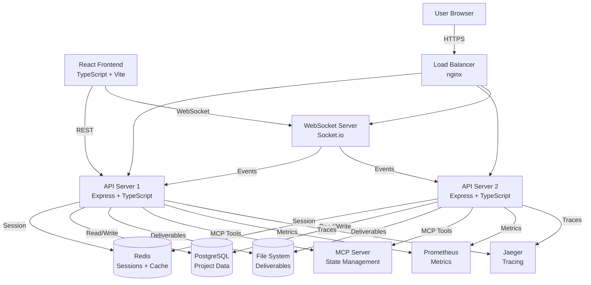

# Product Requirements Document: AiDesigner Modernization & Web UI Integration

**Project**: AiDesigner Framework Modernization  
**Version**: 1.0  
**Date**: October 14, 2025  
**Owner**: Loic Baconnier  
**Status**: Planning

---

## Executive Summary

AiDesigner is evolving from a CLI-first AI agent framework to a modern, full-stack platform with a production-ready web UI. This PRD outlines a comprehensive modernization effort based on the code review findings and the goal of connecting the prototype web UI to real backend data. The project focuses on type safety, API abstraction, real-time communication, and production-readiness while maintaining the framework's core strengths.

**Current State**:

- Well-architected CLI framework with 230/230 tests passing
- Beautiful prototype web UI with mock data
- JavaScript-based core with mixed type safety
- Direct file system access throughout codebase
- MCP server with 10 tools for state management

**Target State**:

- TypeScript-first with comprehensive type safety
- RESTful/WebSocket API for frontend-backend communication
- Real-time web UI with live project state synchronization
- Production-ready deployment infrastructure
- Scalable architecture supporting multiple concurrent users

---

## Strategic Goals

### Primary Objectives

1. **Type Safety First**: Migrate core modules to TypeScript, eliminating runtime type errors and improving developer experience
2. **API-Driven Architecture**: Create abstraction layer enabling frontend-backend separation and future integrations
3. **Real-Time User Experience**: Connect web UI to actual MCP server with live updates via WebSockets
4. **Production Readiness**: Add monitoring, error handling, security, and scalability features for production deployment
5. **Maintain Core Strengths**: Preserve natural language first approach, environment duality, and zero-knowledge interface

### Success Metrics

| Metric                  | Current   | Target       | Timeline |
| ----------------------- | --------- | ------------ | -------- |
| Type Safety Coverage    | 0%        | 80%+         | Week 4   |
| API Response Time       | N/A       | <200ms p95   | Week 7   |
| Frontend Data Freshness | Mock      | Real-time    | Week 9   |
| Test Coverage           | 230 tests | 300+ tests   | Week 10  |
| Production Deployment   | CLI only  | Web UI + API | Week 10  |

---

## Problem Statement

The current AiDesigner implementation faces several challenges that limit its scalability and accessibility:

1. **Limited Type Safety**: JavaScript-based core leads to runtime errors and poor IDE support
2. **Tight Coupling**: Direct file system operations throughout codebase prevent clean frontend-backend separation
3. **No Web API**: Prototype frontend cannot connect to real backend, limiting accessibility
4. **Missing Real-Time Features**: No event system for live updates to UI
5. **Production Gaps**: Insufficient monitoring, error handling, and security for production deployment

These limitations prevent AiDesigner from reaching a broader audience and scaling to support multiple concurrent users in a web environment.

---

## User Stories & Requirements

### Epic 1: TypeScript Migration & Type Safety

**User Story**: As a developer working on AiDesigner, I want comprehensive type safety so that I catch errors at compile time rather than runtime.

**Requirements**:

- R1.1: Convert `lib/project-state.js` to TypeScript with complete interface definitions
- R1.2: Convert `lib/bmad-bridge.js` to TypeScript with type-safe agent loading
- R1.3: Convert `bin/aidesigner` and CLI entry points to TypeScript
- R1.4: Convert `common/utils/assistant-env.js` to TypeScript
- R1.5: Create shared type definitions package for cross-module consistency
- R1.6: Add Zod schemas for runtime validation of all inputs
- R1.7: Ensure 100% of migrated code has type annotations

**Acceptance Criteria**:

- Zero `any` types except in legacy compatibility layers
- All function parameters and return types explicitly typed
- Zod validation for all external inputs (CLI args, API requests, MCP tool calls)
- TypeScript compiler with strict mode enabled
- All existing tests pass with TypeScript compilation

---

### Epic 2: API Abstraction Layer

**User Story**: As a frontend developer, I want a clean REST/WebSocket API so that I can build UIs without direct file system access.

**Requirements**:

- R2.1: Design API interface contracts for state management, agent operations, deliverable generation, and MCP integration
- R2.2: Implement Express.js-based HTTP server with RESTful endpoints
- R2.3: Add WebSocket support for real-time updates (Socket.io or ws)
- R2.4: Create storage adapter abstraction (FileSystemAdapter, InMemoryAdapter, future DatabaseAdapter)
- R2.5: Implement dependency injection pattern for swappable implementations
- R2.6: Add API authentication and authorization (JWT-based)
- R2.7: Create OpenAPI/Swagger documentation for all endpoints

**API Endpoints** (Preliminary):

```
GET    /api/state                  # Get current project state
POST   /api/state                  # Update project state
GET    /api/agents                 # List available agents
GET    /api/agents/:id             # Load specific agent
POST   /api/agents/:id/execute     # Execute agent command
POST   /api/deliverables           # Generate deliverable
GET    /api/deliverables/:type     # Get deliverable by type
POST   /api/phase/detect           # Detect appropriate phase
POST   /api/phase/transition       # Transition to new phase
GET    /api/conversation           # Get conversation history
POST   /api/conversation/message   # Add message
GET    /api/decisions              # Get recorded decisions
POST   /api/decisions              # Record decision
WS     /ws/updates                 # WebSocket for real-time updates
```

**Acceptance Criteria**:

- All endpoints return consistent JSON response format
- Proper HTTP status codes (200, 201, 400, 401, 404, 500)
- Input validation with detailed error messages
- CORS configuration for frontend access
- Rate limiting on API endpoints
- Comprehensive API documentation

---

### Epic 3: Event System & Real-Time Updates

**User Story**: As a user of the web UI, I want to see real-time updates as my project progresses so that I understand what's happening without manual refreshes.

**Requirements**:

- R3.1: Implement EventEmitter-based event bus for internal events
- R3.2: Define event types for phase transitions, deliverable creation, state updates, agent actions
- R3.3: Connect event bus to WebSocket server for broadcasting to clients
- R3.4: Add event subscription/filtering on frontend
- R3.5: Implement reconnection logic for dropped WebSocket connections
- R3.6: Add event persistence for audit trail
- R3.7: Create event visualization in frontend UI

**Event Types**:

```typescript
- 'phase:transition' → { from, to, timestamp, context }
- 'deliverable:created' → { type, path, phase, timestamp }
- 'deliverable:updated' → { type, path, changes, timestamp }
- 'agent:loaded' → { agentId, dependencies, timestamp }
- 'agent:executed' → { agentId, command, duration, result }
- 'state:updated' → { changes, timestamp }
- 'message:added' → { role, content, phase, timestamp }
- 'decision:recorded' → { key, value, rationale, timestamp }
- 'error:occurred' → { code, message, details, timestamp }
```

**Acceptance Criteria**:

- Events broadcast to all connected clients within 100ms
- Frontend UI updates automatically on relevant events
- Event history viewable in developer tools
- No event loss during normal operation
- Graceful degradation if WebSocket unavailable (fallback to polling)

---

### Epic 4: Frontend Integration with Real Data

**User Story**: As a user, I want the web UI to connect to the actual AiDesigner backend so that I can use it for real projects instead of just seeing mock responses.

**Requirements**:

- R4.1: Replace all mock data generation with API calls to backend
- R4.2: Implement WebSocket connection for real-time updates
- R4.3: Add loading states and error handling for all API interactions
- R4.4: Implement optimistic updates for better UX
- R4.5: Add retry logic for failed requests
- R4.6: Create connection status indicator in UI
- R4.7: Add developer mode toggle for API debugging
- R4.8: Implement proper session management

**Frontend Changes**:

- Remove `generateMockResponse()`, `generateMockToolCalls()`, `generateMockHTML()`
- Add `api/` directory with typed API client
- Implement React Context or Redux for global state management
- Add error boundary components for graceful error handling
- Create loading skeletons for better perceived performance
- Add toast notifications for user feedback

**Acceptance Criteria**:

- Zero mock data in production build
- All features from prototype work with real backend
- Error messages are user-friendly and actionable
- UI remains responsive during long-running operations
- Connection loss handled gracefully with user notification
- All TypeScript types match backend API contracts

---

### Epic 5: Production Infrastructure

**User Story**: As a DevOps engineer, I want production-ready infrastructure so that I can deploy and monitor AiDesigner at scale.

**Requirements**:

- R5.1: Add structured logging throughout application (Winston or Pino)
- R5.2: Implement Prometheus metrics for monitoring
- R5.3: Add OpenTelemetry distributed tracing
- R5.4: Create health check endpoints (`/health`, `/ready`)
- R5.5: Implement graceful shutdown handling
- R5.6: Add database support (PostgreSQL) as alternative to file system
- R5.7: Create Docker containerization for frontend and backend
- R5.8: Add Redis for session management and caching
- R5.9: Implement horizontal scaling support
- R5.10: Create comprehensive monitoring dashboard (Grafana)

**Observability Metrics**:

```
- aidesigner_http_requests_total (counter)
- aidesigner_http_request_duration_seconds (histogram)
- aidesigner_websocket_connections_active (gauge)
- aidesigner_phase_transitions_total (counter)
- aidesigner_deliverable_generation_duration_seconds (histogram)
- aidesigner_errors_total (counter by error_type)
- aidesigner_cache_hits_total (counter)
- aidesigner_cache_misses_total (counter)
```

**Acceptance Criteria**:

- All HTTP requests logged with tracing IDs
- Metrics exportable to Prometheus
- Traces viewable in Jaeger
- Health checks return correct status
- Application handles SIGTERM gracefully
- Zero data loss during normal shutdown
- Horizontal scaling tested with 2+ instances

---

### Epic 6: Security Hardening

**User Story**: As a security engineer, I want proper security controls so that user data and credentials are protected.

**Requirements**:

- R6.1: Implement JWT-based authentication
- R6.2: Add role-based access control (RBAC)
- R6.3: Encrypt sensitive data at rest (using existing mcp-security.js patterns)
- R6.4: Add input sanitization for all user inputs
- R6.5: Implement rate limiting per user/IP
- R6.6: Add CSRF protection
- R6.7: Ensure all API calls use HTTPS in production
- R6.8: Add security headers (HSTS, CSP, X-Frame-Options)
- R6.9: Implement audit logging for sensitive operations
- R6.10: Add secrets scanning in CI/CD

**Acceptance Criteria**:

- OWASP Top 10 vulnerabilities addressed
- Penetration testing passes
- Security headers present on all responses
- No secrets in code or git history
- Audit logs track all state mutations
- Authentication required for all API endpoints except health checks

---

### Epic 7: Testing & Quality Assurance

**User Story**: As a QA engineer, I want comprehensive test coverage so that I can verify the system works correctly.

**Requirements**:

- R7.1: Add integration tests for full workflows (analyst → pm → architect → sm → dev)
- R7.2: Create API endpoint tests with supertest
- R7.3: Add WebSocket connection tests
- R7.4: Implement frontend component tests (React Testing Library)
- R7.5: Add end-to-end tests (Playwright or Cypress)
- R7.6: Create load tests for API endpoints (k6 or Artillery)
- R7.7: Add mutation testing (Stryker)
- R7.8: Implement visual regression tests for frontend
- R7.9: Create smoke tests for deployment verification

**Acceptance Criteria**:

- Test coverage >80% for new code
- All integration tests pass
- E2E tests cover critical user paths
- Load tests demonstrate system handles 100 concurrent users
- CI/CD pipeline runs all tests
- No flaky tests in test suite

---

### Epic 8: Documentation & Developer Experience

**User Story**: As a new developer, I want excellent documentation so that I can contribute effectively.

**Requirements**:

- R8.1: Generate API documentation from TypeScript (TypeDoc)
- R8.2: Create architecture diagrams (Mermaid in markdown)
- R8.3: Write deployment guide
- R8.4: Create developer setup guide
- R8.5: Add inline code documentation (JSDoc/TSDoc)
- R8.6: Update CONTRIBUTING.md with new patterns
- R8.7: Create troubleshooting guide
- R8.8: Add code review checklist
- R8.9: Generate Swagger/OpenAPI docs

**Acceptance Criteria**:

- API docs auto-generated and hosted
- Architecture diagrams included in docs/
- New developer can set up environment in <15 minutes
- All public APIs have documentation
- Examples provided for common use cases

---

## Technical Architecture

### System Architecture Diagram



### Technology Stack

**Frontend**:

- React 18 with TypeScript
- Vite for build tooling
- TanStack Query (React Query) for API state management
- Socket.io-client for WebSocket
- Tailwind CSS + shadcn/ui for styling
- Zod for runtime validation
- Vitest for testing

**Backend API Server**:

- Node.js 20+
- Express.js with TypeScript
- Socket.io for WebSocket
- Zod for validation
- Winston for logging
- Prometheus client for metrics
- OpenTelemetry for tracing
- ioredis for Redis
- pg for PostgreSQL
- Jest for testing

**Infrastructure**:

- Docker + Docker Compose for local development
- PostgreSQL 15 for data storage
- Redis 7 for caching and sessions
- nginx for load balancing
- Prometheus + Grafana for monitoring
- Jaeger for distributed tracing

**DevOps**:

- GitHub Actions for CI/CD
- Semantic versioning
- Automated testing in CI
- Docker multi-stage builds
- Environment-based configuration

---

## Implementation Plan

### Phase 1: Foundation (Weeks 1-4)

**Goal**: Establish type safety and core abstractions

**Tasks**:

1. Set up TypeScript build infrastructure (tsconfig, build scripts)
2. Migrate `lib/project-state.js` to TypeScript
3. Migrate `lib/bmad-bridge.js` to TypeScript
4. Migrate CLI entry points to TypeScript
5. Create shared types package (`@aidesigner/types`)
6. Add Zod schemas for all data structures
7. Implement storage adapter abstraction
8. Update existing tests for TypeScript
9. Add type-checking to CI/CD

**Deliverables**:

- TypeScript-based core modules
- Shared types package
- Zero TypeScript errors in CI
- All existing tests passing

**Dependencies**: None

**Risks**:

- Breaking existing CLI functionality during migration
- Mitigation: Maintain backward compatibility, comprehensive testing

---

### Phase 2: API Layer & Event System (Weeks 5-7)

**Goal**: Create backend API server with real-time capabilities

**Tasks**:

1. Design and document API interface contracts
2. Set up Express.js server with TypeScript
3. Implement RESTful endpoints for state, agents, deliverables
4. Add WebSocket server with Socket.io
5. Implement event bus with typed events
6. Connect event bus to WebSocket broadcasts
7. Add JWT authentication
8. Implement rate limiting
9. Create API integration tests
10. Generate OpenAPI documentation

**Deliverables**:

- Running API server on port 3000
- WebSocket server on port 3001
- Complete API documentation
- Postman/Insomnia collection for testing
- Integration test suite

**Dependencies**: Phase 1 complete

**Risks**:

- API design may require iteration based on frontend needs
- Mitigation: Close collaboration with frontend team, rapid prototyping

---

### Phase 3: Frontend Integration (Weeks 8-9)

**Goal**: Connect web UI to real backend with zero mock data

**Tasks**:

1. Create typed API client in frontend
2. Remove all mock data generation
3. Implement TanStack Query for API state
4. Add WebSocket connection and event handling
5. Implement error boundaries and error handling
6. Add loading states and skeletons
7. Implement optimistic updates
8. Add connection status indicator
9. Create frontend integration tests
10. Add developer mode for API debugging

**Deliverables**:

- Fully functional web UI with real data
- Zero mock data in code
- Comprehensive error handling
- Smooth UX with loading states
- Frontend test suite

**Dependencies**: Phase 2 complete

**Risks**:

- Real data may expose UX issues not visible with mocks
- Mitigation: Extensive manual testing, user feedback sessions

---

### Phase 4: Production Infrastructure (Week 10)

**Goal**: Make system production-ready with monitoring and scalability

**Tasks**:

1. Add structured logging throughout application
2. Implement Prometheus metrics
3. Add OpenTelemetry tracing
4. Create health check endpoints
5. Implement graceful shutdown
6. Add PostgreSQL support as storage option
7. Create Docker containers for all services
8. Set up Redis for sessions and caching
9. Configure nginx load balancer
10. Create Grafana monitoring dashboard
11. Test horizontal scaling
12. Document deployment process

**Deliverables**:

- Docker Compose setup for full stack
- Prometheus metrics dashboard
- Jaeger tracing UI
- Grafana monitoring dashboard
- Deployment documentation
- Horizontal scaling validated

**Dependencies**: Phase 3 complete

**Risks**:

- Infrastructure complexity may delay launch
- Mitigation: Use managed services where possible (e.g., managed PostgreSQL, Redis)

---

## Non-Functional Requirements

### Performance

- API response time: <200ms p95, <500ms p99
- WebSocket message latency: <100ms
- Frontend initial load: <2 seconds
- Time to interactive: <3 seconds
- Support 100 concurrent users minimum

### Scalability

- Stateless API servers for horizontal scaling
- Database connection pooling
- Redis for distributed caching
- CDN for static assets

### Reliability

- 99.9% uptime target
- Graceful degradation when services unavailable
- Automatic retry for transient failures
- Data persistence during crashes
- Daily automated backups

### Security

- All data encrypted in transit (HTTPS/WSS)
- Sensitive data encrypted at rest
- Regular security audits
- Dependency vulnerability scanning
- OWASP Top 10 compliance

### Maintainability

- Code coverage >80%
- Automated testing in CI/CD
- Clear separation of concerns
- Comprehensive documentation
- Consistent code style (Prettier, ESLint)

### Usability

- Responsive design (mobile, tablet, desktop)
- Accessible (WCAG 2.1 AA)
- Clear error messages
- Contextual help
- Keyboard navigation support

---

## Migration Strategy

### Backward Compatibility

The CLI interface must continue to work during and after migration:

1. **Dual Mode**: Support both file-based (legacy) and API-based (new) operation
2. **Feature Flags**: Use environment variables to toggle new features
3. **Gradual Migration**: Teams can opt-in to web UI while CLI remains available
4. **Data Migration**: Provide tools to import existing projects to new format

### Rollout Plan

1. **Week 1-4**: Internal testing only, CLI remains primary interface
2. **Week 5-7**: Beta testing with select users, API available but not required
3. **Week 8-9**: Public preview of web UI, encourage migration
4. **Week 10+**: Web UI promoted to primary interface, CLI maintained as alternative

---

## Testing Strategy

### Unit Tests

- All new TypeScript modules
- Storage adapters with mock implementations
- Event bus functionality
- API endpoint handlers

### Integration Tests

- Full workflow tests (analyst → pm → architect → sm → dev)
- API endpoint integration
- WebSocket connection handling
- Database operations

### E2E Tests

- Complete user journeys in web UI
- Multi-phase project creation
- Deliverable generation and download
- Error recovery scenarios

### Performance Tests

- Load testing with k6 (100+ concurrent users)
- Stress testing to find breaking points
- Endurance testing (24-hour runs)
- Spike testing for traffic surges

### Security Tests

- OWASP ZAP automated scanning
- Penetration testing
- Secrets scanning
- Dependency vulnerability checking

---

## Success Criteria

The project will be considered successful when:

1. ✅ Core modules migrated to TypeScript with strict mode enabled
2. ✅ RESTful API with WebSocket support fully operational
3. ✅ Web UI connected to real backend with zero mock data
4. ✅ All 300+ tests passing (unit, integration, E2E)
5. ✅ Production infrastructure deployed and monitored
6. ✅ Documentation complete and published
7. ✅ 10+ beta users successfully using web UI for real projects
8. ✅ Performance targets met (p95 <200ms API response time)
9. ✅ Security audit passed with no critical issues
10. ✅ CLI compatibility maintained

---

## Risks & Mitigation

### Technical Risks

| Risk                            | Probability | Impact | Mitigation                                  |
| ------------------------------- | ----------- | ------ | ------------------------------------------- |
| TypeScript migration breaks CLI | Medium      | High   | Extensive testing, gradual rollout          |
| API performance issues at scale | Medium      | High   | Load testing early, caching strategy        |
| WebSocket stability problems    | Low         | Medium | Fallback to polling, reconnection logic     |
| Database migration complexity   | High        | Medium | Support dual storage modes, migration tools |

### Schedule Risks

| Risk                                    | Probability | Impact | Mitigation                                   |
| --------------------------------------- | ----------- | ------ | -------------------------------------------- |
| Phase 1 takes longer than planned       | Medium      | High   | Start early, parallelize work where possible |
| API design requires multiple iterations | High        | Medium | Prototype quickly, gather feedback early     |
| Frontend integration uncovers issues    | Medium      | Medium | Close collaboration, daily syncs             |

### Resource Risks

| Risk                                      | Probability | Impact | Mitigation                                         |
| ----------------------------------------- | ----------- | ------ | -------------------------------------------------- |
| Key developer unavailable                 | Low         | High   | Knowledge sharing, documentation, pair programming |
| Infrastructure costs higher than expected | Medium      | Low    | Use managed services, monitor spending             |

---

## Open Questions

1. **Database Choice**: Should we support only PostgreSQL or also MySQL/SQLite for different deployment scenarios?
2. **Authentication Provider**: Build custom JWT auth or integrate with Auth0/Clerk?
3. **Deployment Target**: Self-hosted only or also offer managed SaaS option?
4. **Multi-tenancy**: Should the API support multiple organizations/workspaces?
5. **Real-time Collaboration**: Should multiple users be able to work on the same project simultaneously?
6. **LLM Provider**: Should the backend manage LLM API calls or delegate to client?

---

## Appendix A: Code Review Priorities Reference

From `CODE_REVIEW_AND_IMPROVEMENTS.md`:

**Phase 1 Priorities** (covered in this PRD):

- ✅ TypeScript migration of core modules
- ✅ API abstraction layer
- ✅ Standardized error handling
- ✅ Input validation with Zod

**Phase 2 Priorities** (covered in this PRD):

- ✅ Event system implementation
- ✅ Code modularization (natural outcome of TypeScript migration)
- ✅ API documentation generation
- ✅ Integration test suite

**Phase 3 Priorities** (partially covered):

- ⚠️ Caching strategy (included in infrastructure)
- ⚠️ Lazy loading (deferred to performance optimization)
- ⚠️ Streaming for large files (deferred)
- ✅ Database abstraction layer

**Phase 4 Priorities** (covered in this PRD):

- ✅ Monitoring and metrics
- ✅ Distributed tracing
- ✅ Horizontal scaling support
- ⚠️ Message queue integration (deferred to future enhancement)

---

## Appendix B: Frontend Technical Specifications

### API Client Interface

```typescript
// frontend/src/api/client.ts
export interface AiDesignerAPI {
  state: {
    get(): Promise<ProjectState>;
    update(updates: Partial<ProjectState>): Promise<ProjectState>;
  };

  agents: {
    list(): Promise<Agent[]>;
    get(id: string): Promise<Agent>;
    execute(id: string, command: string, context: any): Promise<ExecutionResult>;
  };

  deliverables: {
    generate(type: string, context: any): Promise<Deliverable>;
    get(type: string): Promise<Deliverable | null>;
    list(): Promise<Deliverable[]>;
  };

  phase: {
    detect(context: any): Promise<PhaseDetectionResult>;
    transition(to: Phase, context: any): Promise<TransitionResult>;
  };

  conversation: {
    get(limit?: number): Promise<Message[]>;
    add(message: Message): Promise<void>;
  };

  decisions: {
    get(): Promise<Record<string, Decision>>;
    record(key: string, value: any, rationale: string): Promise<void>;
  };
}
```

### WebSocket Event Handling

```typescript
// frontend/src/api/websocket.ts
export class AiDesignerWebSocket {
  private socket: Socket;
  private eventHandlers: Map<string, EventHandler[]>;

  connect(url: string, token: string): void;
  disconnect(): void;

  on<T = any>(event: string, handler: (data: T) => void): void;
  off(event: string, handler: EventHandler): void;

  private handleReconnection(): void;
  private handleError(error: Error): void;
}
```

---

## Appendix C: Database Schema

### Core Tables

```sql
-- Projects
CREATE TABLE projects (
  id UUID PRIMARY KEY DEFAULT gen_random_uuid(),
  name VARCHAR(255) NOT NULL,
  current_phase VARCHAR(50),
  created_at TIMESTAMP DEFAULT NOW(),
  updated_at TIMESTAMP DEFAULT NOW()
);

-- Project State
CREATE TABLE project_states (
  id UUID PRIMARY KEY DEFAULT gen_random_uuid(),
  project_id UUID REFERENCES projects(id) ON DELETE CASCADE,
  requirements JSONB,
  decisions JSONB,
  next_steps TEXT,
  lane_history JSONB[],
  created_at TIMESTAMP DEFAULT NOW()
);

-- Conversations
CREATE TABLE conversations (
  id UUID PRIMARY KEY DEFAULT gen_random_uuid(),
  project_id UUID REFERENCES projects(id) ON DELETE CASCADE,
  role VARCHAR(50) NOT NULL,
  content TEXT NOT NULL,
  phase VARCHAR(50),
  metadata JSONB,
  created_at TIMESTAMP DEFAULT NOW()
);

-- Deliverables
CREATE TABLE deliverables (
  id UUID PRIMARY KEY DEFAULT gen_random_uuid(),
  project_id UUID REFERENCES projects(id) ON DELETE CASCADE,
  type VARCHAR(100) NOT NULL,
  phase VARCHAR(50),
  content TEXT NOT NULL,
  metadata JSONB,
  created_at TIMESTAMP DEFAULT NOW()
);

-- Decisions
CREATE TABLE decisions (
  id UUID PRIMARY KEY DEFAULT gen_random_uuid(),
  project_id UUID REFERENCES projects(id) ON DELETE CASCADE,
  key VARCHAR(255) NOT NULL,
  value JSONB NOT NULL,
  rationale TEXT,
  created_at TIMESTAMP DEFAULT NOW()
);

-- Reviews
CREATE TABLE reviews (
  id UUID PRIMARY KEY DEFAULT gen_random_uuid(),
  project_id UUID REFERENCES projects(id) ON DELETE CASCADE,
  checkpoint VARCHAR(100) NOT NULL,
  status VARCHAR(50) NOT NULL,
  summary TEXT,
  risks JSONB,
  follow_up JSONB,
  created_at TIMESTAMP DEFAULT NOW()
);

-- Events (for audit trail)
CREATE TABLE events (
  id UUID PRIMARY KEY DEFAULT gen_random_uuid(),
  project_id UUID REFERENCES projects(id) ON DELETE CASCADE,
  event_type VARCHAR(100) NOT NULL,
  data JSONB NOT NULL,
  created_at TIMESTAMP DEFAULT NOW()
);

-- Indexes
CREATE INDEX idx_projects_updated_at ON projects(updated_at);
CREATE INDEX idx_conversations_project_id ON conversations(project_id);
CREATE INDEX idx_conversations_created_at ON conversations(created_at);
CREATE INDEX idx_deliverables_project_id ON deliverables(project_id);
CREATE INDEX idx_deliverables_type ON deliverables(type);
CREATE INDEX idx_decisions_project_id ON decisions(project_id);
CREATE INDEX idx_events_project_id ON events(project_id);
CREATE INDEX idx_events_event_type ON events(event_type);
CREATE INDEX idx_events_created_at ON events(created_at);
```

---

## Version History

| Version | Date       | Author         | Changes              |
| ------- | ---------- | -------------- | -------------------- |
| 1.0     | 2025-10-14 | Loic Baconnier | Initial PRD creation |

---

**Approval Sign-off**:

| Role                | Name           | Date | Signature |
| ------------------- | -------------- | ---- | --------- |
| Product Owner       | Loic Baconnier |      |           |
| Tech Lead           |                |      |           |
| Engineering Manager |                |      |           |
