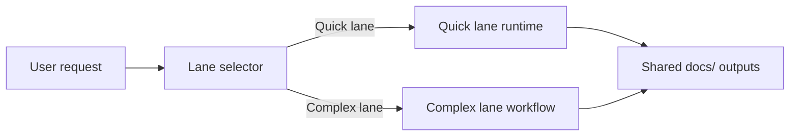

# AiDesigner

[](LICENSE)
[](https://nodejs.org)
[](https://www.npmjs.com/package/aidesigner)
[](https://www.npmjs.com/package/aidesigner)

<div align="center">

### 🚀 **From Idea to Shipped Product: Design + Development in One Flow**

**Conversational UI design → Design tokens → Visual concepts → Agile implementation**

_The complete journey: Ideation • UI Design • Token Extraction • Code Generation_

[Quick Start](#quick-start) • [See It In Action](#natural-conversation-example) • [Documentation](docs/user-guide.md)

</div>

---

## The Complete Journey: Idea → Design → Code

**The Problem:** Building a product requires orchestrating multiple disciplines:

- **Ideation**: Understanding what to build and for whom
- **UI/UX Design**: Creating visual concepts that resonate with users
- **Design Systems**: Establishing consistent tokens (colors, typography, spacing)
- **Architecture**: Technical decisions that support the design vision
- **Development**: Writing code that matches the design specifications

Traditional approach? **Weeks of handoffs between designers, architects, and developers.**

AI tools today? **Disconnected point solutions that don't talk to each other.**

**There has to be a better way.**

## The AiDesigner Way: Integrated Workflow, Professional Results

A single conversational journey that takes you from idea to production-ready code:

### 💡 Phase 1: Idea & Discovery

Natural conversation about your concept, user journeys, and success criteria

### 🎨 Phase 2: UI Design (The Innovation)

- **Conversational UI Designer** walks you through each screen
- **Chrome MCP Integration** extracts design tokens from inspiration URLs
- **Visual Concept Generation** with Gemini/Nano Banana per screen
- **Design System Lock-In** ensures consistency (colors, fonts, spacing)

### 🚀 Phase 3: Agile Implementation

- **Auto-generated PRD** incorporating design decisions
- **Technical Architecture** with component mappings (Shadcn, MUI)
- **Development Stories** with visual context and design tokens
- **Code Generation** with design-locked constraints

**No context switching. No information loss between phases. One continuous flow.**

### How It Works

**1. Start the Conversation**

```bash
npx aidesigner@latest start
```

Talk naturally about your idea. The AI guides you through:

- What you're building and why
- Who will use it
- Key user journeys and screens

**2. Design Your UI (Core Innovation)**

The **Conversational UI Designer** walks you through each screen:

```
AI: "Let's design your dashboard. Do you have inspiration?"
You: "Linear.app has the vibe I want"
AI: "Extracting design tokens from Linear.app..."

    🎨 Extracted:
    - Colors: #5E6AD2 (primary), #3D9970 (accent)
    - Typography: Inter 400/600
    - Spacing: 4px, 8px, 16px, 24px

    What should we keep vs change?
```

Get visual concept prompts for each screen, ready for Gemini/Nano Banana.

**3. Automatic Transition to Development**

Your design decisions automatically flow into:

- PRD with visual requirements
- Architecture with component mappings
- Development stories with design tokens
- Code generation with design-locked constraints

**No manual handoffs. Design decisions become development constraints.**

### What Makes AiDesigner Different

🎨 **Conversational UI Design (The Bridge)**

> Traditional: Specs → Designer → Mockups → Handoff → Development
> AiDesigner: Natural conversation → Design tokens → Visual concepts → Code generation
> **Design decisions become code constraints in real-time**

🔍 **Smart Token Extraction**

> Other tools: Manual design system documentation
> AiDesigner: "Share an inspiration URL" → Chrome MCP extracts colors, fonts, spacing
> **From inspiration to implementation in minutes**

🎯 **Design-to-Development Continuity**

> Traditional: Design files → Developer interpretation → Inconsistent implementation
> AiDesigner: Design tokens locked → Components mapped (Shadcn/MUI) → Code generated with constraints
> **What you design is exactly what gets built**

🚀 **Complete Integrated Workflow**

> Other tools: Separate tools for planning, design, and development
> AiDesigner: Idea → UI Design → Agile Implementation in one conversation
> **No context switching, no information loss**

🔒 **Local-First, Private**

> No API calls to external services
> Runs through Claude CLI, Codex CLI, or OpenCode
> Your data never leaves your machine

### Key Features

**Complete Journey Coverage:**

- **Conversational Discovery** - Natural dialogue about your idea, users, and success criteria
- **UI Journey Mapping** - Screen-by-screen walkthrough with contextual design questions
- **Chrome MCP Token Extraction** - Pull design tokens from inspiration URLs (Linear, Notion, Stripe, etc.)
- **Visual Concept Generation** - Per-screen Gemini/Nano Banana prompts with full context
- **Design System Lock-In** - Consistent colors, typography, spacing across all screens
- **Agile Implementation** - PRD, architecture, and stories incorporating design decisions
- **Component Mapping** - Shadcn/MUI component selection with design constraints
- **Code Generation** - Production-ready code with design-locked tokens

**Built on Proven Methods:**

- **BMAD Agile Methodology** - Battle-tested processes, invisible to users
- **Local & Private** - Works with Claude CLI, Codex CLI, or OpenCode
- **No API Costs** - Your data never leaves your machine

> **The Innovation: Conversational UI Designer** - The only workflow that bridges design and development in one continuous conversation. From "I have this idea" to "Here's your production code" without losing context. [See the complete workflow →](#the-complete-ui-design-workflow)

## Quick Start

### Prerequisites

- Node.js ≥ 20.10.0
- npm ≥ 9.0.0
- One chat CLI installed: Claude CLI, Codex CLI, or OpenCode CLI

### Installation

```bash
# One command does everything
npx aidesigner@latest start

# Optional: Specify assistant and provider
npx aidesigner@latest start --assistant=claude --glm
```

That's it! This command:

1. Creates project structure
2. Installs dependencies
3. Builds MCP server
4. Launches chosen chat interface

→ **[Complete Installation Guide](docs/installation-methods.md)** - All installation options

## Natural Conversation Example

```
You: "I want to build an app for tracking family chores"

AI: "Great! Let's figure this out together.
     Who will be using this app?"

You: "Parents and kids, ages 8 and up"

AI: "Perfect. What does success look like?"

[... natural conversation continues ...]

AI: "📋 Here's what I understand:
     Project: Family Chore Tracking App
     Users: Parents & children (8+)
     Timeline: 3 months
     Platform: Mobile-first

     Is this correct? (y/n)"
```

Behind the scenes, aidesigner generates:

- Project brief (analyst phase)
- Product requirements document (PM phase)
- Technical architecture (architect phase)
- User stories (scrum master phase)
- Implementation guidance (dev phase)

All organized in `docs/` folder, ready to use.

→ **[Complete Examples](docs/examples.md)** - Detailed walkthrough examples

## The Complete UI Design Workflow

**The first AI workflow that bridges idea, design, and implementation in one continuous conversation.**

This is the heart of AiDesigner - where your concept transforms into visual specifications and design-locked code.

### 🎨 How Real Designers Work

1. **Discover the journey** - "Walk me through how users will flow through your app"
2. **Deep-dive each step** - "What's the user's mindset on this screen? What emotion should they feel?"
3. **Gather inspiration** - "Share a reference URL - I'll extract the colors, fonts, and spacing"
4. **Define visual language** - "Let's lock in your palette, typography, and layout system"
5. **Generate concepts** - "Here are tailored prompts for each screen with all the context"

**aidesigner's UI Designer Liaison does exactly this.**

### Quick Lane (Auto Mode)

```
You: "I want to build a task management app for remote teams"

AI: "✅ Generated PRD, architecture, and stories
     📋 Quick Lane also created:

     docs/ui/ui-designer-screen-prompts.md

     I've inferred your user journey from the PRD:
     1. Browse tasks
     2. Search & filter
     3. Create task
     4. Task details
     5. Assign & collaborate

     Each screen has a tailored visual concept prompt ready for
     Google Nano Banana (Gemini 2.5 Flash Image).

     Copy the prompts to https://aistudio.google.com and get
     3 concept variations per screen!"
```

**Time:** Under 5 minutes, fully automatic

### Complex Lane (Conversational Mode)

```
You: "@ui-designer-liaison"

Nana: "Hi! I'm Nana, your UI designer liaison. Ready to craft your
       visual journey?

       🎨 Existing inspiration (URLs, reference designs)
       ✨ From scratch (I'll guide you)
       🔀 Both

       Which approach works best?"

You: "I have Linear.app as inspiration"

Nana: "Perfect! I notice you want to use Linear.app for reference.

       To automatically extract colors, typography, and CSS tokens,
       I recommend enabling Chrome DevTools MCP. It's optional but
       saves manual work.

       Would you like to activate it?"

You: "Yes, it's enabled"

Nana: "Excellent! Let me extract the visual elements...

       🎨 Color Palette:
       - Primary: #5E6AD2 (purple)
       - Accent: #3D9970 (green)
       - Neutral: #6B7280 (gray)

       ✍️ Typography:
       - Headings: 'Inter', sans-serif (600 weight)
       - Body: 'Inter', sans-serif (400 weight)

       📏 Spacing: 4px, 8px, 12px, 16px, 24px, 32px

       What elements should we KEEP vs AVOID from Linear?"

You: "Keep the minimal sidebar and generous spacing. Avoid the complex
      command palette."

Nana: "Got it! Now walk me through your ideal user journey from first
       touch to success..."

[... 6-stage conversational flow continues ...]

Nana: "✅ Visual concept prompts generated!

       📄 docs/ui/ui-designer-screen-prompts.md

       5 screens mapped:
       1. Browse tasks
       2. Search & filter
       3. Create task
       4. Task details
       5. Collaborate

       Each prompt includes:
       - Journey context (position, adjacent steps)
       - Persona mindset & goals
       - CSS tokens from Linear.app
       - Your visual preferences

       Copy to Google AI Studio and generate concepts!"
```

**Time:** 10-15 minutes, rich context, CSS extraction

### What You Get

**Per-Screen Prompts** like this:

```
You are Google Nano Banana (Gemini 2.5 Flash Image).
Render 3 concept options for the **Search & Filter** step of TaskFlow Pro.

## Context
- Journey position: Step 2 of 5 (Early exploration phase)
- Previous step: Browse tasks
- Next step: Task details
- Persona mindset: User with specific criteria looking to narrow task list
- Screen goal: Filter tasks by status, assignee, due date efficiently
- Emotional tone: Focused, in-control

## Visual System
### Brand Palette
#5E6AD2, #3D9970, #6B7280

**CSS Tokens:**
--color-primary: #5E6AD2;
--color-accent: #3D9970;
--font-heading: 'Inter', sans-serif;
--space-base: 4px;
--space-md: 12px;

### Typography
- Heading: Inter 600
- Body: Inter 400
- Scale: 14px body, 18px subtitle, 24px heading

[... complete prompt with all context ...]
```

### Chrome MCP Integration

**Extract design tokens from any URL:**

1. Share a reference URL (Linear, Notion, Stripe, etc.)
2. Chrome DevTools MCP automatically captures:
   - Color palette (hex codes)
   - Typography (font families, weights, sizes)
   - Spacing tokens (margins, padding)
   - CSS custom properties
3. Tokens embedded in every screen prompt
4. Developers get CSS-ready specifications

### Log Your Selection

```
You: "*log-selection"

Nana: "Let's record your selected visual concept!

       Which concept did you choose?"

You: "Concept 2 - the clean minimal with purple accents"

Nana: "Perfect! I'll log:
       ✅ Visual characteristics
       ✅ Journey context (5 screens)
       ✅ CSS tokens from Linear.app
       ✅ Per-screen prompts used
       ✅ Asset locations

       Saved to: docs/ui/ui-designer-explorations.md

       This informs:
       - Frontend architecture
       - Component library setup
       - Design system documentation"
```

### Benefits

🚀 **10x Faster Than Traditional Design**

> Traditional: Designer creates mockups (days) → Revisions (days) → Developer handoff
> aidesigner: Conversation (10 min) → Concepts (minutes) → CSS tokens included

🎯 **Context-Aware Prompts**

> Generic tools: Single prompt for entire app
> aidesigner: Tailored prompt per screen with journey context

🔧 **Developer-Ready Output**

> Other tools: Images only
> aidesigner: Images + CSS tokens + design system documentation

💡 **Inspiration Made Actionable**

> Copy visual elements: Manual color picking from screenshots
> aidesigner: Automatic CSS extraction with Chrome DevTools MCP

### Try It Now

**Quick Lane (Auto):**

```bash
npx aidesigner@latest start
# Describe your UI project
# Get visual prompts automatically
```

**Complex Lane (Conversational):**

```bash
npx aidesigner@latest start
# Activate: @ui-designer-liaison
# Run: *discover-journey
# Full 6-stage designer conversation
```

→ **[Complete UI Designer Guide](docs/guides/CONVERSATIONAL_UI_DESIGNER.md)** - Full workflow documentation
→ **[Using Google Nano Banana](docs/guides/USING_GOOGLE_NANO_BANANA.md)** - Google AI Studio integration

## Extend with Any Tool

Add powerful integrations through natural conversation:

```
You: "I need GitHub integration"

AI: "I can help with that! I'll set up GitHub access.
     What's your GitHub personal access token?"

You: "ghp_****"

AI: "✓ GitHub integration configured!
     Please restart your chat session for changes to take effect."

[You restart the CLI]

You: "Create an issue for the login bug"

AI: "✓ Created issue #42: 'Fix login authentication error'"
```

```
You: "I need database access"

AI: "Sure! What database are you using?"

You: "PostgreSQL at localhost"

AI: "✓ PostgreSQL access configured!
     Restart your chat to start using database features."
```

**Available integrations** (15+): GitHub, PostgreSQL, Filesystem, Chrome DevTools, Brave Search, Slack, AWS, and more.

→ **[MCP Management Guide](docs/mcp-management.md)** - Complete integration guide

## How It Works

```
User: "I want to build an app"
  ↓
[Analyst Phase - Gathers requirements]
  ↓
[PM Phase - Creates development plan]
  ↓
[Architect Phase - Designs technical approach]
  ↓
[Scrum Master Phase - Breaks into stories]
  ↓
[Dev Phase - Guides implementation]
  ↓
[QA Phase - Validates quality]
  ↓
[All phases happen through natural conversation]
```

### Dual-Lane Orchestration

aidesigner automatically steers every request through the right mix of speed and depth. You never toggle a switch—the system senses complexity and elevates the workflow the moment your project needs more than a quick brief.

#### Quick Lane: 3-minute briefs

The quick lane boots up your `docs/` workspace in minutes, generating the core folders and drafting the product requirement, architecture outline, user stories, and Google Nano Banana visual concept brief you need to get moving. It is designed for lightweight asks where momentum matters most, giving you production-ready assets without waiting on a full committee.

#### Complex Lane: BMAD depth on demand

When scope grows, the complex lane inherits everything the quick lane has already staged and then unleashes the full BMAD multi-agent orchestration. Analysts deepen the research, product managers expand the PRD, architects iterate on design, and delivery experts refine stories—all while building on the same documentation spine so nothing gets lost in translation.

#### Seamless hand-off, consistent outcomes

Because both lanes converge on the exact same deliverables, you can trust that every project—simple or sophisticated—arrives with the same professional PRD, architecture, and story set. The automatic hand-off means you stay in flow while aidesigner keeps your `docs/` assets synchronized and production-ready.



**Summary:** The Quick Lane runtime sequentially loads the Spec Kit–derived spec, plan, and tasks templates—calling the LLM at each step to author `docs/prd.md`, `docs/architecture.md`, and `docs/stories/*.md`—while the Complex lane employs the multi-agent BMAD workflow to produce the same deliverables through coordinated specialists.

- **Spec Kit Step – Product Spec Template** ↔ **BMAD Phase – Analyst Discovery & Product Framing**
- **Spec Kit Step – Delivery Plan Template** ↔ **BMAD Phase – Architecture & Planning Alignment**
- **Spec Kit Step – Tasks Template** ↔ **BMAD Phase – Story Breakdown & Delivery Execution**

→ **[DUAL_LANE_ORCHESTRATION.md](docs/DUAL_LANE_ORCHESTRATION.md)** - Technical details

## LLM Provider Support

Choose your provider during installation:

```bash
# Use ZhipuAI GLM
npx aidesigner@latest start --glm

# Use Anthropic Claude (default)
npx aidesigner@latest start --anthropic
```

→ **[Configuration Guide](docs/configuration.md)** - Complete configuration reference

## Documentation

- **[Quick Start Guide](docs/guides/QUICKSTART.md)** - ⭐ First-time setup
- **[Examples](docs/examples.md)** - Real-world usage examples
- **[Installation Methods](docs/installation-methods.md)** - All installation options
- **[Configuration](docs/configuration.md)** - LLM providers, environment variables
- **[MCP Management](docs/mcp-management.md)** - Tool integration guide
- **[Architecture](docs/core-architecture.md)** - System design
- **[Contributing](docs/guides/CONTRIBUTING.md)** - Contribution guidelines
- **[BMAD-METHOD™](https://github.com/bmadcode/bmad-method)** - Core framework

## Current Status

**FULLY IMPLEMENTED AND PRODUCTION-READY** ✅

### What Works

✅ MCP-based orchestration with 10 tools
✅ Natural conversation interface
✅ Intelligent dual-lane routing
✅ Phase detection and transitions
✅ Deliverable generation (PRD, architecture, stories)
✅ Project state persistence
✅ Full BMAD agent integration
✅ Claude, Codex, and OpenCode CLI support
✅ ZhipuAI GLM and Anthropic providers

### Generated Artifacts

```
my-project/
├── docs/
│   ├── brief.md                        # Project context
│   ├── prd.md                          # Product requirements
│   ├── architecture.md                 # Technical design
│   ├── epics/*.md                      # Feature epics
│   ├── stories/*.md                    # User stories
│   └── ui/
│       ├── nano-banana-brief.md        # Google Nano Banana visual concept prompt
│       └── nano-banana-explorations.md # Logged visual concept selections
└── .aidesigner/
    ├── state.json                      # Current phase
    └── conversation.log                # Full history
```

## Repository layout & npm package contents

AiDesigner ships a lot of assets because the conversational workflow spans agents, templates, expansion packs, and compiled MCP tooling. The table below highlights the top-level directories so you can see what is required at runtime versus what only helps maintainers. When you install via `npx aidesigner`, everything marked "Yes" is bundled; the rest is excluded through the npm ignore rules so the install stays lightweight.

| Path                                                                                  | Purpose                                                                                  | Required for runtime? | Shipped with `npx`? |
| ------------------------------------------------------------------------------------- | ---------------------------------------------------------------------------------------- | --------------------- | ------------------- |
| `bin/`                                                                                | Node entrypoints that `npx aidesigner` executes.                                         | ✅                    | ✅                  |
| `common/`                                                                             | Shared utilities (integrity checks, environment helpers) imported by the CLI binaries.   | ✅                    | ✅                  |
| `dist/`                                                                               | Pre-built MCP server, codex runtime, and packaged agent/team bundles.                    | ✅                    | ✅                  |
| `aidesigner-core/`                                                                    | Canonical agents, tasks, templates, and checklists consumed by the orchestrator bridge.  | ✅                    | ✅                  |
| `agents/`                                                                             | Legacy agent markdown used as a fallback search path for the bridge.                     | ✅                    | ✅                  |
| `hooks/`                                                                              | Context enrichment/transition hooks loaded by the MCP runtime.                           | ✅                    | ✅                  |
| `expansion-packs/`                                                                    | Source material for optional industry packs—kept for integrity checks and customization. | ✅                    | ✅                  |
| `apps/`, `docs/`, `packages/`, `prompts/`, `todolist.md`, `MCP_INTEGRATION_REPORT.md` | Developer documentation, experiments, and research notes.                                | ❌                    | ❌                  |

> 📦 **Why not delete the dev directories?** They are vital for maintaining the content that gets compiled into `dist/` and for publishing new expansion packs, but they are skipped during npm publishing so they do not slow down `npx` installs.

## Contributing

Contributions welcome! Key areas:

- Additional test coverage
- Custom template variations
- Integration examples
- Performance optimizations
- Documentation improvements

See [CONTRIBUTING.md](docs/guides/CONTRIBUTING.md) for guidelines.

## Related Projects

- **[BMAD-METHOD™](https://github.com/bmadcode/bmad-method)** - Core framework
- **[Model Context Protocol](https://modelcontextprotocol.io/)** - State persistence layer

## License

MIT License - see [LICENSE](LICENSE) for details.

## Acknowledgments

Built on [BMAD-METHOD™](https://github.com/bmadcode/bmad-method) by Brian (BMad) Madison.

BMAD™ and BMAD-METHOD™ are trademarks of BMad Code, LLC.

---

**Current Version**: v1.4.0 - Production Ready ✅

**Get Started**: `npx aidesigner@latest start`

**Questions?** Open an issue or check the [BMAD repository](https://github.com/bmadcode/bmad-method).

<sub>Making AI-assisted development accessible to everyone through natural conversation</sub>
