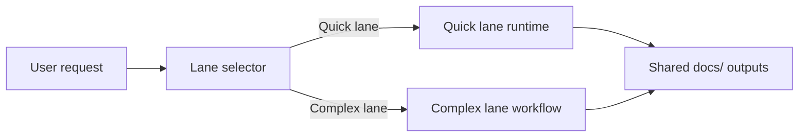

# Agilai

[](LICENSE)
[](https://nodejs.org)
[](https://www.npmjs.com/package/agilai)
[](https://www.npmjs.com/package/agilai)

**Ship specs in under five minutes with Quick Lane or run enterprise-grade deep dives with Complex Lane—no methodology training required.**

## The Problem

Building software with AI should be simple. Instead, developers waste hours figuring out _how_ to ask AI for help rather than actually building.

Professional teams use structured agile methodologies (analyst → PM → architect → developer → QA), but learning these frameworks takes weeks and adds unnecessary friction.

## The Solution

**Agilai gives you professional agile workflows through natural conversation.**

Just talk about your project. The system:

✅ **Understands** what you're building (no framework jargon needed)
✅ **Generates** professional deliverables automatically (PRD, architecture, user stories)
✅ **Guides** you through proven development phases invisibly
✅ **Routes** work intelligently: Quick Lane for fast specs and briefs (under five minutes), Complex Lane for enterprise PRDs, architectures, and QA-ready stories

**You focus on ideas. Agilai handles methodology.**

### Key Features

- **Zero learning curve** - Chat naturally, no methodology training
- **Proven framework** - Built on BMAD-METHOD™ battle-tested processes
- **Intelligent dual lanes** - Quick Lane ships actionable specs, briefs, and implementation notes in under five minutes
- **Complex-ready depth** - Complex Lane drives enterprise-grade PRDs, architectures, test plans, and user stories
- **Professional output** - Industry-standard documentation
- **Local-first** - Works with Claude CLI, Codex CLI, or OpenCode
- **No API costs** - Runs through your existing CLI tooling

> **Two-Lane Orchestration:** Start in the speed-focused Quick Lane or unlock the depth of the Complex Lane—see the [Dual-Lane Orchestration](#dual-lane-orchestration) section below to learn how Agilai orchestrates both without extra prompts.

## Quick Start

### Prerequisites

- Node.js ≥ 20.10.0
- npm ≥ 9.0.0
- One chat CLI installed: Claude CLI, Codex CLI, or OpenCode CLI

### Installation

```bash
# One command does everything
npx agilai@latest start

# Optional: Specify assistant and provider
npx agilai@latest start --assistant=claude --glm
```

That's it! This command:

1. Creates project structure
2. Installs dependencies
3. Builds MCP server
4. Launches chosen chat interface

→ **[Complete Installation Guide](docs/installation-methods.md)** - All installation options

## Natural Conversation Example

```
You: "I want to build an app for tracking family chores"

AI: "Great! Let's figure this out together.
     Who will be using this app?"

You: "Parents and kids, ages 8 and up"

AI: "Perfect. What does success look like?"

[... natural conversation continues ...]

AI: "📋 Here's what I understand:
     Project: Family Chore Tracking App
     Users: Parents & children (8+)
     Timeline: 3 months
     Platform: Mobile-first

     Is this correct? (y/n)"
```

Behind the scenes, Agilai generates:

- Project brief (analyst phase)
- Product requirements document (PM phase)
- Technical architecture (architect phase)
- User stories (scrum master phase)
- Implementation guidance (dev phase)

All organized in `docs/` folder, ready to use.

→ **[Complete Examples](docs/examples.md)** - Detailed walkthrough examples

## Extend with Any Tool

Add powerful integrations through natural conversation:

```
You: "I need GitHub integration"

AI: "I can help with that! I'll set up GitHub access.
     What's your GitHub personal access token?"

You: "ghp_****"

AI: "✓ GitHub integration configured!
     Please restart your chat session for changes to take effect."

[You restart the CLI]

You: "Create an issue for the login bug"

AI: "✓ Created issue #42: 'Fix login authentication error'"
```

```
You: "I need database access"

AI: "Sure! What database are you using?"

You: "PostgreSQL at localhost"

AI: "✓ PostgreSQL access configured!
     Restart your chat to start using database features."
```

**Available integrations** (15+): GitHub, PostgreSQL, Filesystem, Puppeteer, Brave Search, Slack, AWS, and more.

→ **[MCP Management Guide](docs/mcp-management.md)** - Complete integration guide

## How It Works

```
User: "I want to build an app"
  ↓
[Analyst Phase - Gathers requirements]
  ↓
[PM Phase - Creates development plan]
  ↓
[Architect Phase - Designs technical approach]
  ↓
[Scrum Master Phase - Breaks into stories]
  ↓
[Dev Phase - Guides implementation]
  ↓
[QA Phase - Validates quality]
  ↓
[All phases happen through natural conversation]
```

### Dual-Lane Orchestration

Agilai automatically steers every request through the right mix of speed and depth. You never toggle a switch—the system senses complexity and elevates the workflow the moment your project needs more than a quick brief.

#### Quick Lane: 3-minute briefs

The quick lane boots up your `docs/` workspace in minutes, generating the core folders and drafting the product requirement, architecture outline, user stories, and Google Nano Banana visual concept brief you need to get moving. It is designed for lightweight asks where momentum matters most, giving you production-ready assets without waiting on a full committee.

#### Complex Lane: BMAD depth on demand

When scope grows, the complex lane inherits everything the quick lane has already staged and then unleashes the full BMAD multi-agent orchestration. Analysts deepen the research, product managers expand the PRD, architects iterate on design, and delivery experts refine stories—all while building on the same documentation spine so nothing gets lost in translation.

#### Seamless hand-off, consistent outcomes

Because both lanes converge on the exact same deliverables, you can trust that every project—simple or sophisticated—arrives with the same professional PRD, architecture, and story set. The automatic hand-off means you stay in flow while Agilai keeps your `docs/` assets synchronized and production-ready.



**Summary:** The Quick Lane runtime sequentially loads the Spec Kit–derived spec, plan, and tasks templates—calling the LLM at each step to author `docs/prd.md`, `docs/architecture.md`, and `docs/stories/*.md`—while the Complex lane employs the multi-agent BMAD workflow to produce the same deliverables through coordinated specialists.

- **Spec Kit Step – Product Spec Template** ↔ **BMAD Phase – Analyst Discovery & Product Framing**
- **Spec Kit Step – Delivery Plan Template** ↔ **BMAD Phase – Architecture & Planning Alignment**
- **Spec Kit Step – Tasks Template** ↔ **BMAD Phase – Story Breakdown & Delivery Execution**

→ **[DUAL_LANE_ORCHESTRATION.md](docs/DUAL_LANE_ORCHESTRATION.md)** - Technical details

## LLM Provider Support

Choose your provider during installation:

```bash
# Use ZhipuAI GLM
npx agilai@latest start --glm

# Use Anthropic Claude (default)
npx agilai@latest start --anthropic
```

→ **[Configuration Guide](docs/configuration.md)** - Complete configuration reference

## Documentation

- **[Quick Start Guide](docs/guides/QUICKSTART.md)** - ⭐ First-time setup
- **[Examples](docs/examples.md)** - Real-world usage examples
- **[Installation Methods](docs/installation-methods.md)** - All installation options
- **[Configuration](docs/configuration.md)** - LLM providers, environment variables
- **[MCP Management](docs/mcp-management.md)** - Tool integration guide
- **[Architecture](docs/core-architecture.md)** - System design
- **[Contributing](docs/guides/CONTRIBUTING.md)** - Contribution guidelines
- **[BMAD-METHOD™](https://github.com/bmadcode/bmad-method)** - Core framework

## Current Status

**FULLY IMPLEMENTED AND PRODUCTION-READY** ✅

### What Works

✅ MCP-based orchestration with 10 tools
✅ Natural conversation interface
✅ Intelligent dual-lane routing
✅ Phase detection and transitions
✅ Deliverable generation (PRD, architecture, stories)
✅ Project state persistence
✅ Full BMAD agent integration
✅ Claude, Codex, and OpenCode CLI support
✅ ZhipuAI GLM and Anthropic providers

### Generated Artifacts

```
my-project/
├── docs/
│   ├── brief.md                        # Project context
│   ├── prd.md                          # Product requirements
│   ├── architecture.md                 # Technical design
│   ├── epics/*.md                      # Feature epics
│   ├── stories/*.md                    # User stories
│   └── ui/
│       ├── nano-banana-brief.md        # Google Nano Banana visual concept prompt
│       └── nano-banana-explorations.md # Logged visual concept selections
└── .agilai/
    ├── state.json                      # Current phase
    └── conversation.log                # Full history
```

## Contributing

Contributions welcome! Key areas:

- Additional test coverage
- Custom template variations
- Integration examples
- Performance optimizations
- Documentation improvements

See [CONTRIBUTING.md](docs/guides/CONTRIBUTING.md) for guidelines.

## Related Projects

- **[BMAD-METHOD™](https://github.com/bmadcode/bmad-method)** - Core framework
- **[Model Context Protocol](https://modelcontextprotocol.io/)** - State persistence layer

## License

MIT License - see [LICENSE](LICENSE) for details.

## Acknowledgments

Built on [BMAD-METHOD™](https://github.com/bmadcode/bmad-method) by Brian (BMad) Madison.

BMAD™ and BMAD-METHOD™ are trademarks of BMad Code, LLC.

---

**Current Version**: v1.4.0 - Production Ready ✅

**Get Started**: `npx agilai@latest start`

**Questions?** Open an issue or check the [BMAD repository](https://github.com/bmadcode/bmad-method).

<sub>Making AI-assisted development accessible to everyone through natural conversation</sub>
