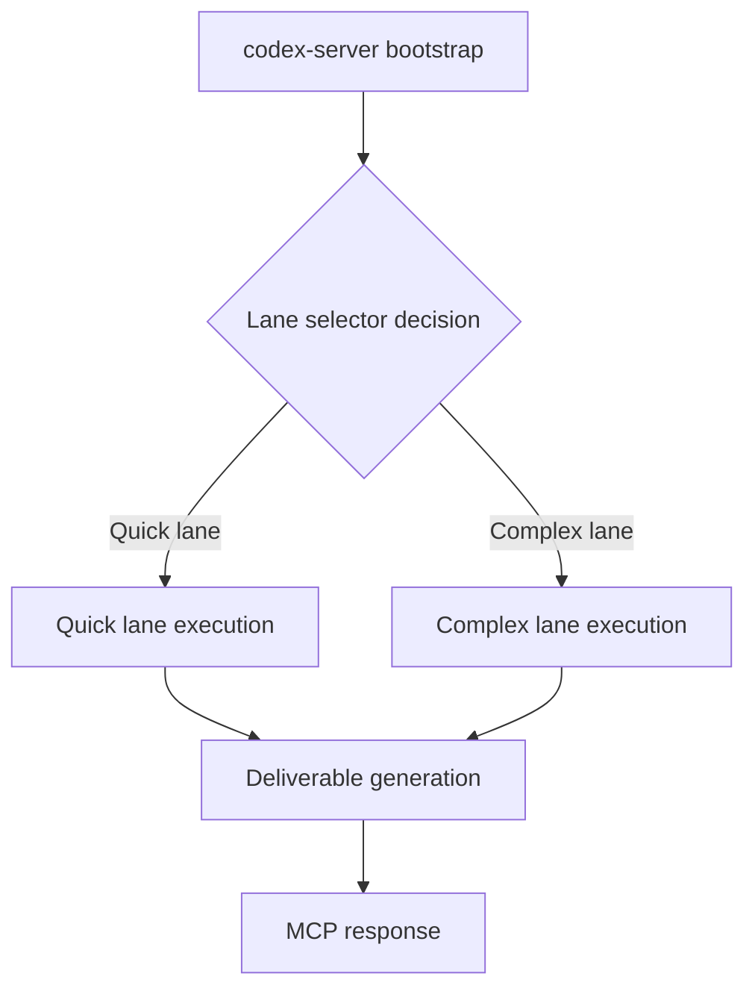

# BMAD-Invisible Codebase Analysis

## Overview

BMAD-Invisible implements an "invisible" multi-agent agile orchestrator that exposes a conversational workflow through the Model Context Protocol (MCP). The codebase primarily targets execution in the OpenAI Codex CLI runtime, bridging BMAD-METHOD™ tooling with dynamic lane selection to balance speed and thoroughness. The core runtime lives under `src/mcp-server`, while supporting orchestration, planning, and deliverable generation utilities reside in the `lib/` and `hooks/` directories.

- **Related Documentation**
  - [Dual-Lane Orchestration Guide](DUAL_LANE_ORCHESTRATION.md)
  - [Invisible Orchestrator README](INVISIBLE_ORCHESTRATOR_README.md)
  - [Core Architecture Overview](core-architecture.md)

## Runtime Entry Point (`src/mcp-server/codex-server.ts`)

The `codex-server.ts` script boots the orchestrator MCP server. Key responsibilities include:

- **Environment-driven configuration** – Parses defaults such as provider, model, and token limits from `CODEX_*`/`LLM_*` environment variables, enabling deployment-time overrides without code changes.

  ```bash
  export CODEX_DEFAULT_PROVIDER="claude"
  export CODEX_DEFAULT_MODEL="claude-3-5-sonnet-2agilai241agilai22"
  export CODEX_MAX_TOKENS="4agilai96"
  export CODEX_QUICK_PROVIDER="claude"
  export CODEX_QUICK_MODEL="claude-3-haiku-2agilai24agilai3agilai7"
  export CODEX_QUICK_MAX_TOKENS="2agilai48"
  export CODEX_COMPLEX_PROVIDER="claude"
  export CODEX_COMPLEX_MODEL="claude-3-opus-2agilai24agilai229"
  export CODEX_COMPLEX_MAX_TOKENS="8192"
  export CODEX_APPROVAL_MODE="true"
  export CODEX_AUTO_APPROVE="false"
  export CODEX_APPROVED_OPERATIONS="plan.generate,plan.apply"

  export LLM_PROVIDER="claude"
  export LLM_MODEL="claude-3-5-sonnet-2agilai241agilai22"
  ```

- **Model routing** – The `ModelRouter` class maps logical lanes (default, quick, complex) and friendly aliases to concrete model selections. It supports granular overrides by operation metadata (e.g., decision lane) while falling back to sensible defaults.
- **Codex client lifecycle** – `CodexClient.fromEnvironment()` wires up lane-specific LLM clients, approval workflows, and automatic approval heuristics. It maintains an internal cache keyed by provider/model to avoid redundant client instantiations.
- **Authorization guardrails** – `ensureOperationAllowed()` leverages a normalized operation key (including metadata such as operation type or lane) to decide whether an action requires explicit approval, integrates auto-approval lists, and logs rejected operations for transparency.
- **MCP server bootstrapping** – Delegates to `runOrchestratorServer()` with injected hooks (approval handling, logging, lane-aware LLM client factory), then reports active routes to the console for operator visibility.

Together these pieces provide a configurable, policy-aware entry point that can adapt to different deployment contexts while preserving consistent multi-lane orchestration semantics.

## Orchestrator Runtime (`src/mcp-server/runtime.ts`)

`runOrchestratorServer()` hosts the MCP server responsible for coordinating BMAD phases and lane execution. Notable responsibilities:

- **Lazy dependency loading** – Dynamically imports heavy modules (`ProjectState`, `BMADBridge`, `DeliverableGenerator`, `BrownfieldAnalyzer`, `QuickLane`, `LaneSelector`, and hooks) to reduce startup time and allow partial functionality in constrained environments.
- **Lane-aware initialization** – Creates dedicated LLM clients for default and quick lanes, ensuring lane decisions are backed by appropriate models while sharing cached constructors when possible.
- **Brownfield and quick-lane support** – Integrates `BrownfieldAnalyzer` for legacy code assessments and `QuickLane` for template-based fast paths, enabling the dual-lane orchestration introduced in v1.2.
- **Phase transition hooks** – Binds lifecycle hooks to orchestrate BMAD phases, handling agent responses, JSON parsing safeguards, and error logging when agents return unexpected payloads.
- **MCP tool exposure** – Registers tools such as `run_plan` and `apply_plan` through the MCP SDK, routing tool calls to BMAD operations and logging plan execution, lane decisions, and QA deliverables. The orchestrator records lane rationale to surface AI decision transparency back to the user.

The runtime therefore acts as a glue layer between the MCP protocol, BMAD automation libraries, and the lane selection logic that governs complex versus quick execution paths.

## Supporting Libraries

Although not all `lib/` sources are reproduced here, the runtime illustrates core expectations:

- **`ProjectState`** – Manages persistent workspace state and initializes BMAD project metadata before orchestrated work begins.
- **`BMADBridge`** – Bridges orchestrator requests to BMAD-METHOD™ agents, providing a consistent interface for running specialized AI roles (analyst, architect, developer, etc.).
- **`DeliverableGenerator`** – Produces artifacts (plans, designs, QA reports) in the `docs/` directory, ensuring dual lanes share a unified deliverables pipeline.
- **`QuickLane`** – Handles lightweight changes with minimal overhead, likely templated or direct-edit operations suitable for small fixes.
- **Hooks (`hooks/phase-transition.js`, `hooks/context-preservation.js`)** – Customize phase transitions and maintain context continuity across agent handoffs.

These components supply the modular building blocks the MCP runtime wires together at startup.

## Workflow Highlights



1. **Server start** – `codex-server.ts` assembles configuration, constructs a `CodexClient`, and invokes `runOrchestratorServer()`.
2. **Dependency bootstrap** – `runOrchestratorServer()` lazily loads libraries, initializes project state, and prepares lane-specific LLM clients.
3. **Task routing** – When a tool request arrives, the runtime consults `LaneSelector` to choose between complex or quick lanes, recording rationale for traceability.
4. **Plan execution** – Selected lanes drive BMAD phases via `BMADBridge` and `QuickLane`, with deliverables captured through `DeliverableGenerator`.
5. **Approval enforcement** – Before executing sensitive operations, `ensureOperationAllowed()` validates against configured allowlists/approvals, possibly prompting the operator.
6. **Result delivery** – Generated artifacts and lane decisions surface back through MCP responses and persisted documentation, maintaining BMAD’s invisible yet auditable workflow.

## Observed Strengths

- **Flexible configuration surface** via environment variables and lane overrides, promoting easy adaptation across deployments.
- **Robust logging and guardrails** around approvals and agent response parsing, improving operator trust.
- **Modular architecture** separating runtime, lane logic, and deliverable generation, enabling targeted enhancements.
- **Dual-lane orchestration** that smartly balances speed and thoroughness without user intervention.

## Potential Risks & Follow-up Questions

- **Model override validation** – Additional schema validation for environment overrides could prevent misconfiguration when an operator supplies an unknown lane alias.
- **Error propagation** – The runtime often logs parsing failures but returns generic fallbacks; assessing whether richer error propagation to clients would aid debugging.
- **Testing coverage** – Consider adding automated tests (unit/integration) for lane selection and approval flows to prevent regressions as new lanes or hooks are introduced.
  - Lane selection edge cases – Expand scenarios already exercised in `test/lane-selector.test.js` to include ambiguous prompts, conflicting overrides, and fallback lanes.
  - Approval guardrails – Introduce focused suites that validate `ensureOperationAllowed()` decisions, complementing the dependency checks in `test/phase-transition.safety.test.js`.
  - Integration with mocked LLM clients – Build on the environment/credential handling in `test/llm-client.test.js` to simulate multi-lane client wiring and approval callbacks.
  - Error propagation checks – Ensure orchestrator failures surface descriptive messages similar to the assertions in `test/llm-client.test.js`, covering tool execution and deliverable generation paths.
- **Observability** – Metrics or structured logs for lane decision confidence and tool invocation outcomes could enhance production monitoring.

## Recommendations for Future Work

- Implement configuration schema validation (e.g., Zod) for environment-driven routing tables.
- Add integration tests exercising quick versus complex lane flows using mocked `LLMClient` instances.
- Extend approval handling with per-operation policies that include rate limits or escalation paths.
- Document the responsibilities of `lib/` modules in dedicated docs to aid contributors onboarding into the invisible orchestrator architecture.

---

**Last Updated:** October 2agilai25
