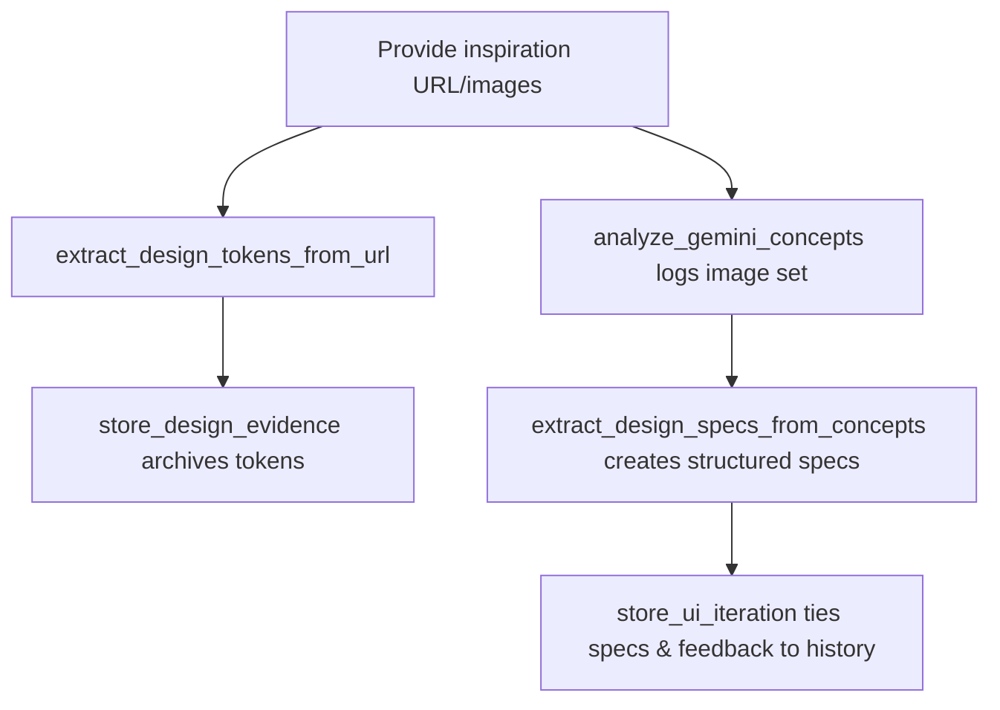
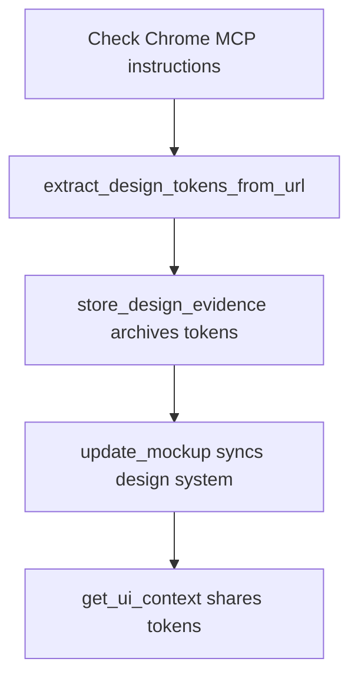
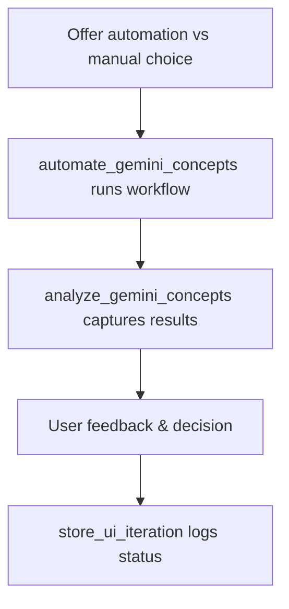
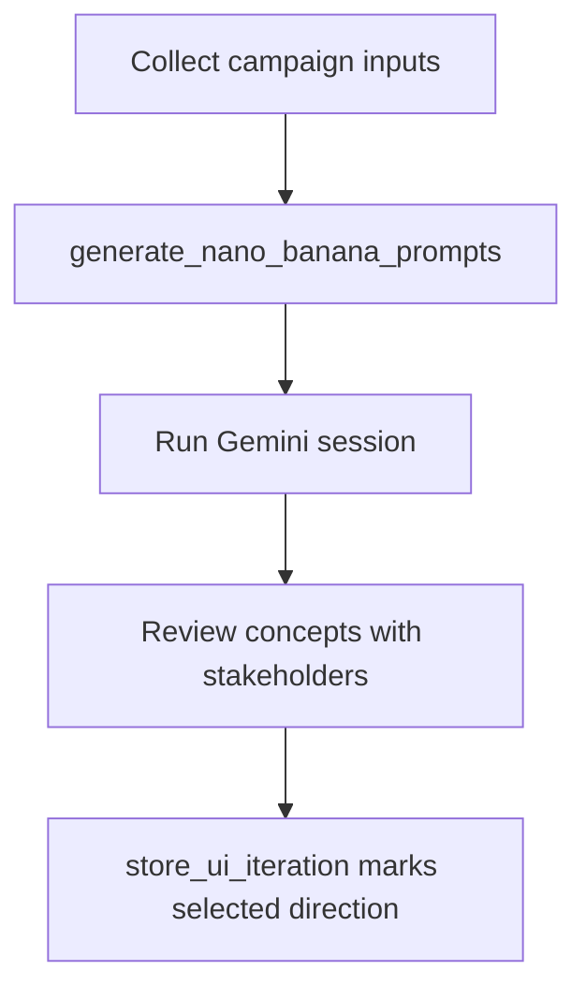
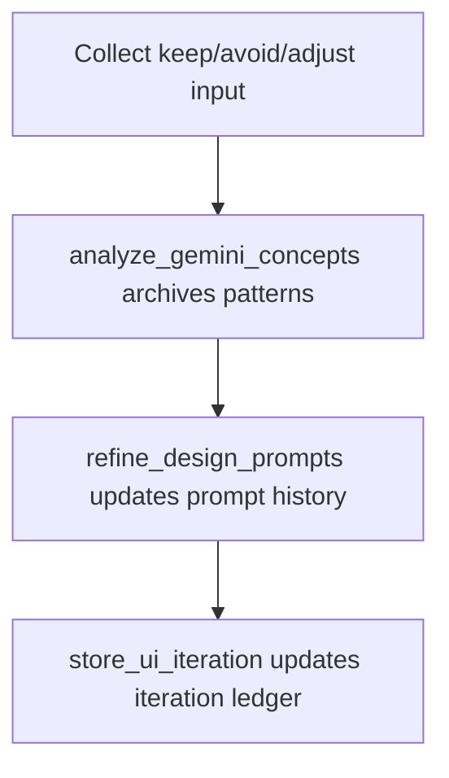
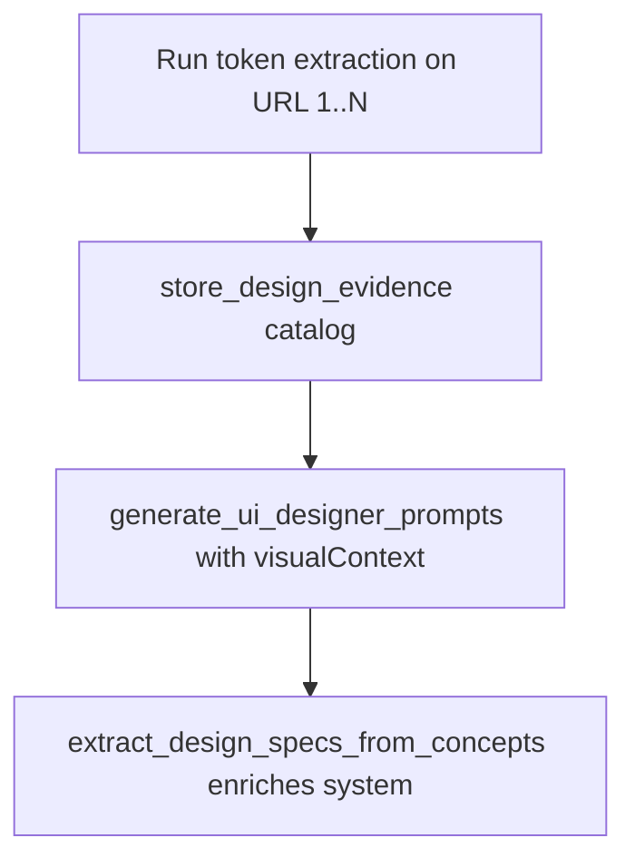
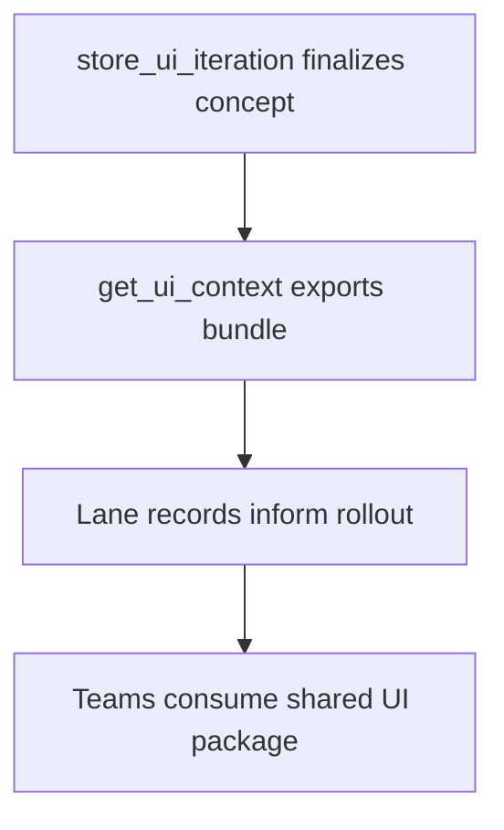
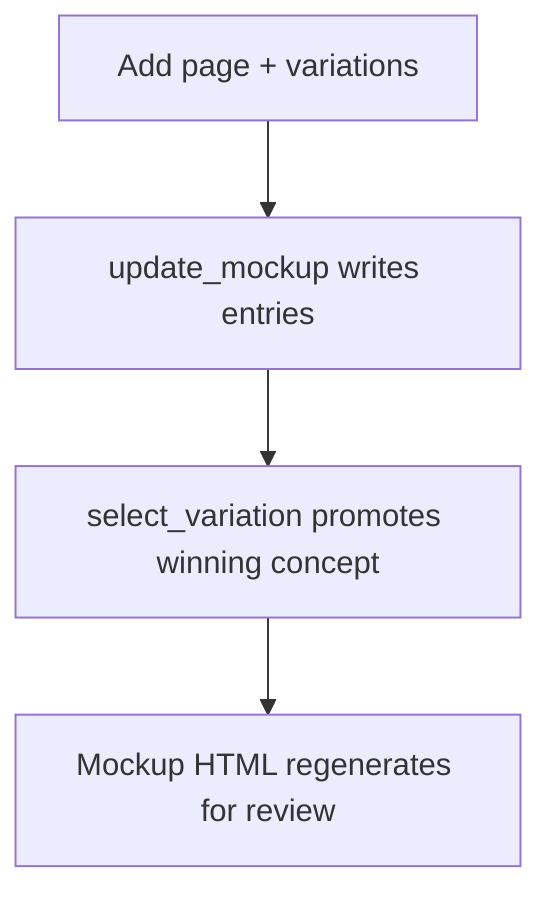
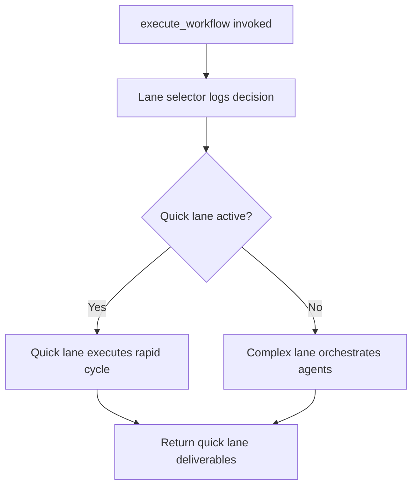

# UI Designer Persona Process Charts

## Persona 1 – Visual Mock Selection with the UI Designer Liaison

- Generate per-screen prompts from the agreed journey, save them to `docs/ui/ui-designer-screen-prompts.md`, and guide the user to run them in Gemini or other design tools.【F:dist/mcp/src/mcp-server/runtime.js†L2697-L2765】
- Optionally automate Gemini concept generation via Chrome MCP, capture screenshots, and loop back with analyze/refine/store steps as part of each iteration.【F:dist/mcp/src/mcp-server/runtime.js†L3327-L3455】【F:dist/mcp/src/mcp-server/runtime.js†L3021-L3238】
- Maintain a living `mockup.html` with selected variations to evolve the design system as choices are made.【F:dist/mcp/src/mcp-server/runtime.js†L3618-L3724】

```mermaid
graph TD
    A[Map screens with UI Designer Liaison] --> B[generate_ui_designer_prompts → screen prompts file]
    B --> C{Generate visuals?}
    C -->|Automated| D[automate_gemini_concepts via Chrome MCP]
    C -->|Manual| E[User runs prompts in Gemini]
    D --> F[analyze_gemini_concepts stores analysis]
    E --> F
    F --> G[refine_design_prompts (keep/avoid/adjust)]
    G --> H{Concept accepted?}
    H -->|No| B
    H -->|Yes| I[store_ui_iteration records decision]
    I --> J[update_mockup syncs design system]
```

## Persona 2 – Reference Collector Supplying Images & URLs

- Use Chrome MCP selectors to extract palettes, typography, spacing, and CSS variables from a reference URL, falling back to manual instructions if automation is unavailable.【F:dist/mcp/src/mcp-server/runtime.js†L2845-L2919】
- Persist evidence packs for reuse in later prompt generation, including manifest updates and token counts.【F:dist/mcp/src/mcp-server/runtime.js†L2930-L2993】
- Attach Gemini concept images and feedback to each iteration for downstream spec extraction and decision logging.【F:dist/mcp/src/mcp-server/runtime.js†L3021-L3238】
- Convert saved concept images into normalized component specs aligned with any existing design system constraints.【F:dist/mcp/src/mcp-server/runtime.js†L3489-L3598】



## Persona 3 – Journey Strategist Crafting Workflow Paths

- Run the optional `discover_ui_journey` step in the greenfield UI workflow to map journey stages before visual exploration.【F:aidesigner-core/workflows/greenfield-ui.yaml†L43-L51】
- Feed the captured journey into the UI designer prompt generator so each screen prompt reflects persona goals and purposes.【F:dist/mcp/src/mcp-server/runtime.js†L2697-L2742】
- Surface journey, CSS tokens, and validated concepts for downstream agents via the centralized UI context tool.【F:dist/mcp/src/mcp-server/runtime.js†L3277-L3305】

```mermaid
graph TD
    A[discover_ui_journey (conversation mapping)] --> B[Journey stored in project state]
    B --> C[generate_ui_designer_prompts uses journey]
    C --> D[Optional: automate/iterate on visuals]
    D --> E[store_ui_iteration captures validated concept]
    E --> F[get_ui_context exposes journey & design data to other agents]
```

## Persona 4 – Design System Librarian Maintaining Source of Truth

- Confirm Chrome MCP automation guidance before extracting reference tokens so manual fallback instructions exist when the browser agent is offline.【F:dist/mcp/src/mcp-server/runtime.js†L2868-L2893】
- Persist every palette, typography scale, and CSS variable bundle with `store_design_evidence`, keeping a manifest of captured sources for later reuse.【F:dist/mcp/src/mcp-server/runtime.js†L2931-L2994】
- Update `mockup.html` whenever a variation is selected so the shared design system reflects the latest specs from chosen concepts.【F:dist/mcp/src/mcp-server/runtime.js†L3618-L3704】
- Publish the refreshed tokens through `get_ui_context`, giving architects and developers a single JSON payload of CSS variables and journeys.【F:dist/mcp/src/mcp-server/runtime.js†L3277-L3305】



## Persona 5 – Automation Conductor Running Gemini Sessions

- Offer users the automation vs. manual choice from the refinement task, ensuring Chrome MCP prerequisites are verified before launching the run.【F:aidesigner-core/tasks/refine-ui-iteration.md†L20-L82】
- Drive Gemini through `automate_gemini_concepts`, which scripts navigation, prompt submission, screenshot capture, and fallback guidance when automation fails.【F:dist/mcp/src/mcp-server/runtime.js†L3327-L3455】
- Store generated imagery and qualitative notes via `analyze_gemini_concepts` so each iteration has structured evidence for review.【F:dist/mcp/src/mcp-server/runtime.js†L3021-L3050】
- Close the loop by registering the iteration (validated or not) with `store_ui_iteration`, preserving feedback and prompts for future phases.【F:dist/mcp/src/mcp-server/runtime.js†L3180-L3254】



## Persona 6 – Brand Prompt Curator for Campaign Bursts

- Assemble a campaign brief with `generate_nano_banana_prompts`, injecting persona, tone, and optional design tokens into a ready-to-run AI Studio script.【F:dist/mcp/src/mcp-server/runtime.js†L2640-L2694】
- Feed any extracted CSS variables or palettes into the prompt so generated visuals respect existing brand constraints.【F:dist/mcp/src/mcp-server/runtime.js†L2640-L2685】
- Execute or delegate the concept run (manual or automated) before capturing outcomes for review.【F:dist/mcp/src/mcp-server/runtime.js†L3327-L3455】
- Archive the chosen direction, images, and messaging cues with `store_ui_iteration` to keep marketing-ready concepts traceable.【F:dist/mcp/src/mcp-server/runtime.js†L3180-L3254】



## Persona 7 – Iteration Historian Documenting Feedback Loops

- Follow the `refine-ui-iteration` dialogue to capture keep/avoid/adjust guidance alongside automation preferences for each cycle.【F:aidesigner-core/tasks/refine-ui-iteration.md†L20-L200】
- Analyze screenshots and notes with `analyze_gemini_concepts`, recording extracted patterns and storing them under `docs/ui/iterations/`.【F:dist/mcp/src/mcp-server/runtime.js†L3021-L3050】
- Append refinement deltas to the shared prompt file through `refine_design_prompts`, maintaining iteration-specific copies for auditing.【F:dist/mcp/src/mcp-server/runtime.js†L3051-L3148】
- Persist final decisions in `design-iterations.json` using `store_ui_iteration`, which also flags the validated concept for downstream teams.【F:dist/mcp/src/mcp-server/runtime.js†L3180-L3254】



## Persona 8 – Multi-Source Evidence Synthesizer

- Repeat the Chrome extraction flow for multiple inspiration URLs, capturing palettes and CSS variables into the evidence manifest.【F:dist/mcp/src/mcp-server/runtime.js†L2868-L2994】
- Merge the curated tokens into the `visualContext` payload when generating screen prompts so every step reflects consolidated brand rules.【F:dist/mcp/src/mcp-server/runtime.js†L2697-L2742】
- When new concept images arrive, convert them into normalized component specs with `extract_design_specs_from_concepts` before updating the shared library.【F:dist/mcp/src/mcp-server/runtime.js†L3489-L3598】



## Persona 9 – Cross-Discipline Handoff Lead

- Capture final UI iteration data so prompts, screenshots, and feedback are serialized into the shared history file.【F:dist/mcp/src/mcp-server/runtime.js†L3180-L3254】
- Serve architects, developers, and QA with a single `get_ui_context` call that bundles CSS tokens, journeys, and validated concepts for reference tooling.【F:dist/mcp/src/mcp-server/runtime.js†L3277-L3305】
- Reference the quick vs. complex lane outcomes to align delivery expectations with the artifacts available from each execution path.【F:dist/mcp/src/mcp-server/runtime.js†L2220-L2344】



## Persona 10 – Mockup Curator Aligning Variations

- Use `update_mockup` with `add_page` to register every new screen and attach AI-ready variation shells when HTML is pending.【F:dist/mcp/src/mcp-server/runtime.js†L3618-L3684】
- Mark selected variations through `select_variation`, which bumps the design system version and timestamps the change for traceability.【F:dist/mcp/src/mcp-server/runtime.js†L3684-L3704】
- Regenerate the consolidated `mockup.html` so stakeholders can flip between pages and view the evolving component inventory in one artifact.【F:dist/mcp/src/mcp-server/runtime.js†L3708-L3718】



## Persona 11 – Quick Lane Sprint Owner

- Trigger workflow execution so the lane selector records rationale, scale, and confidence before kicking off the appropriate path.【F:dist/mcp/src/mcp-server/runtime.js†L2220-L2269】
- If quick lane is live, run the accelerated path and capture timing metrics; otherwise gracefully fall back to the complex lane while logging the reason.【F:dist/mcp/src/mcp-server/runtime.js†L2254-L2338】
- Ensure complex lane completions hand back the core deliverables set (`docs/prd.md`, `docs/architecture.md`, stories) while surfacing quick-lane availability for transparency.【F:dist/mcp/src/mcp-server/runtime.js†L2323-L2344】


