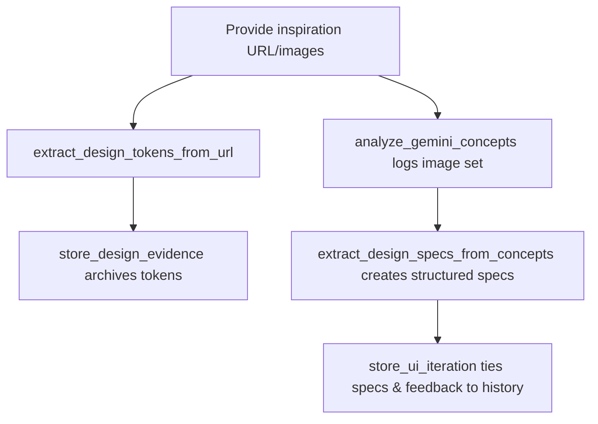

# UI Designer Persona Process Charts

## Persona 1 – Visual Mock Selection with the UI Designer Liaison

- Generate per-screen prompts from the agreed journey, save them to `docs/ui/ui-designer-screen-prompts.md`, and guide the user to run them in Gemini or other design tools.【F:dist/mcp/src/mcp-server/runtime.js†L2697-L2765】
- Optionally automate Gemini concept generation via Chrome MCP, capture screenshots, and loop back with analyze/refine/store steps as part of each iteration.【F:dist/mcp/src/mcp-server/runtime.js†L3327-L3455】【F:dist/mcp/src/mcp-server/runtime.js†L3021-L3238】
- Maintain a living `mockup.html` with selected variations to evolve the design system as choices are made.【F:dist/mcp/src/mcp-server/runtime.js†L3618-L3724】

```mermaid
graph TD
    A[Map screens with UI Designer Liaison] --> B[generate_ui_designer_prompts → screen prompts file]
    B --> C{Generate visuals?}
    C -->|Automated| D[automate_gemini_concepts via Chrome MCP]
    C -->|Manual| E[User runs prompts in Gemini]
    D --> F[analyze_gemini_concepts stores analysis]
    E --> F
    F --> G[refine_design_prompts (keep/avoid/adjust)]
    G --> H{Concept accepted?}
    H -->|No| B
    H -->|Yes| I[store_ui_iteration records decision]
    I --> J[update_mockup syncs design system]
```

## Persona 2 – Reference Collector Supplying Images & URLs

- Use Chrome MCP selectors to extract palettes, typography, spacing, and CSS variables from a reference URL, falling back to manual instructions if automation is unavailable.【F:dist/mcp/src/mcp-server/runtime.js†L2845-L2919】
- Persist evidence packs for reuse in later prompt generation, including manifest updates and token counts.【F:dist/mcp/src/mcp-server/runtime.js†L2930-L2993】
- Attach Gemini concept images and feedback to each iteration for downstream spec extraction and decision logging.【F:dist/mcp/src/mcp-server/runtime.js†L3021-L3238】
- Convert saved concept images into normalized component specs aligned with any existing design system constraints.【F:dist/mcp/src/mcp-server/runtime.js†L3489-L3598】



## Persona 3 – Journey Strategist Crafting Workflow Paths

- Run the optional `discover_ui_journey` step in the greenfield UI workflow to map journey stages before visual exploration.【F:aidesigner-core/workflows/greenfield-ui.yaml†L43-L51】
- Feed the captured journey into the UI designer prompt generator so each screen prompt reflects persona goals and purposes.【F:dist/mcp/src/mcp-server/runtime.js†L2697-L2742】
- Surface journey, CSS tokens, and validated concepts for downstream agents via the centralized UI context tool.【F:dist/mcp/src/mcp-server/runtime.js†L3277-L3305】

```mermaid
graph TD
    A[discover_ui_journey (conversation mapping)] --> B[Journey stored in project state]
    B --> C[generate_ui_designer_prompts uses journey]
    C --> D[Optional: automate/iterate on visuals]
    D --> E[store_ui_iteration captures validated concept]
    E --> F[get_ui_context exposes journey & design data to other agents]
```
