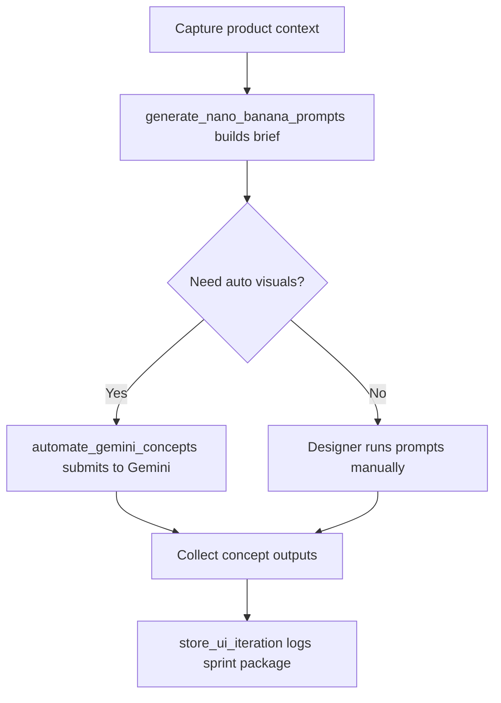
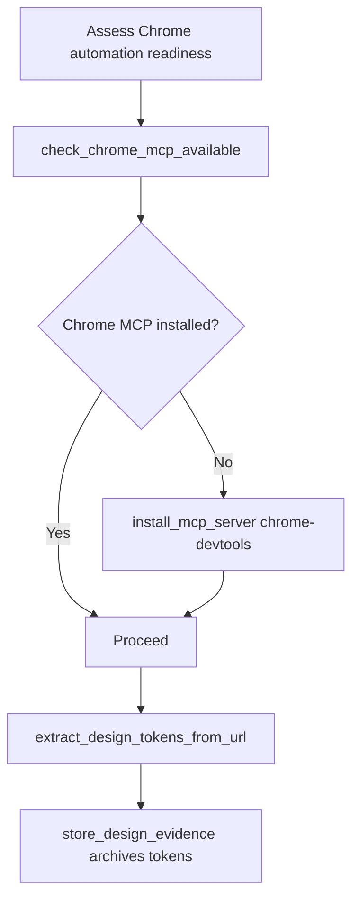
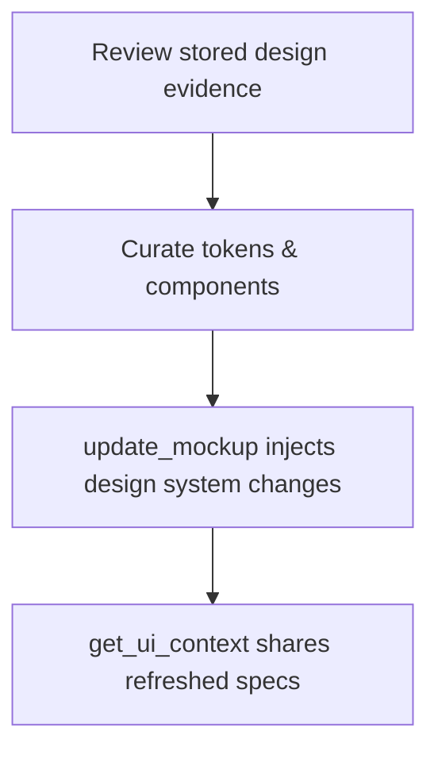
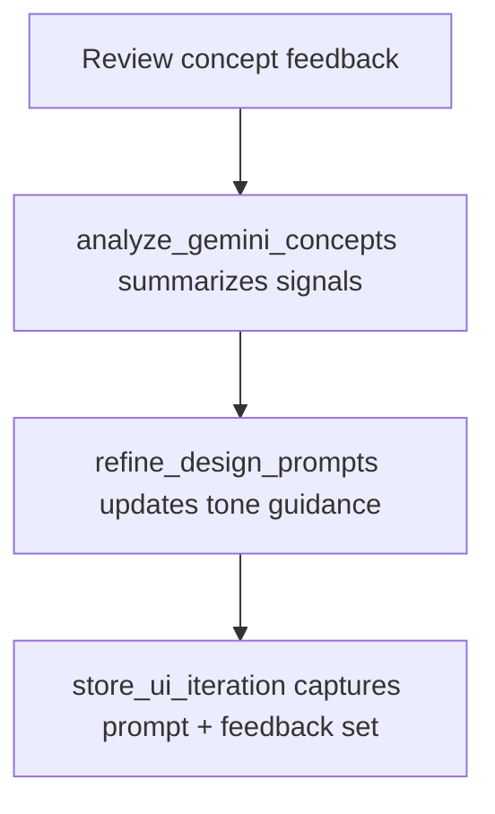
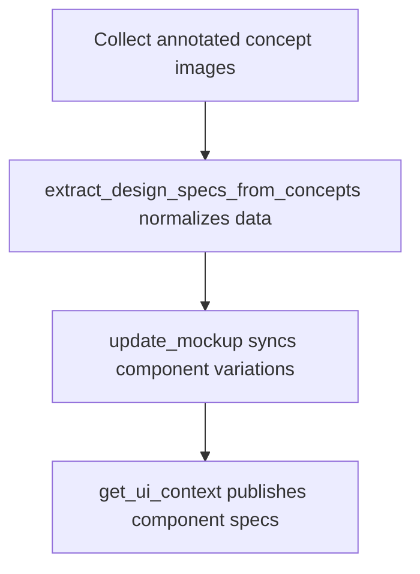
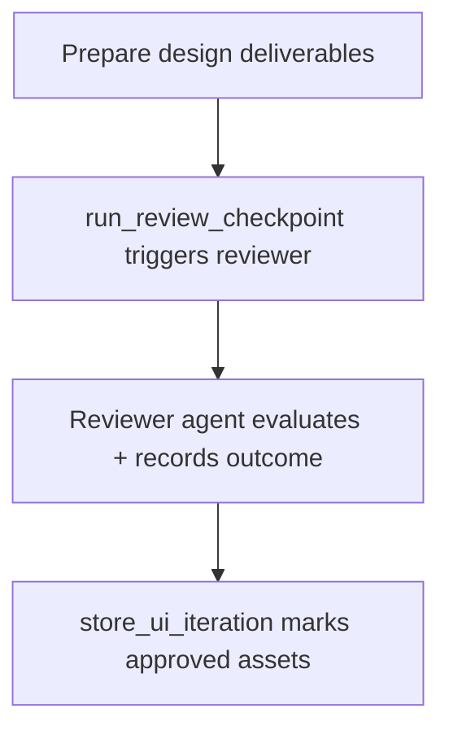
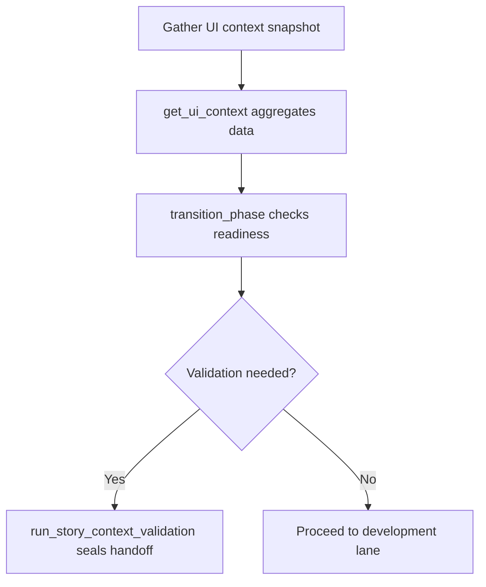
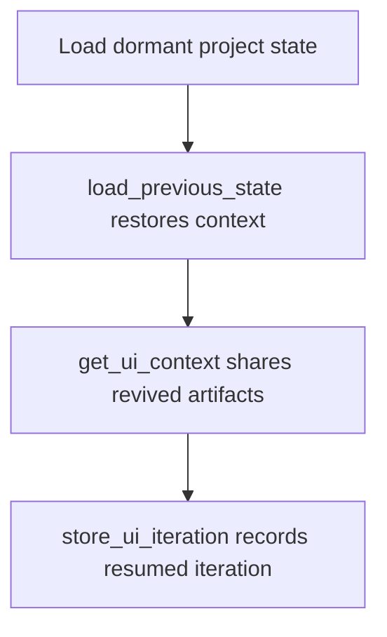
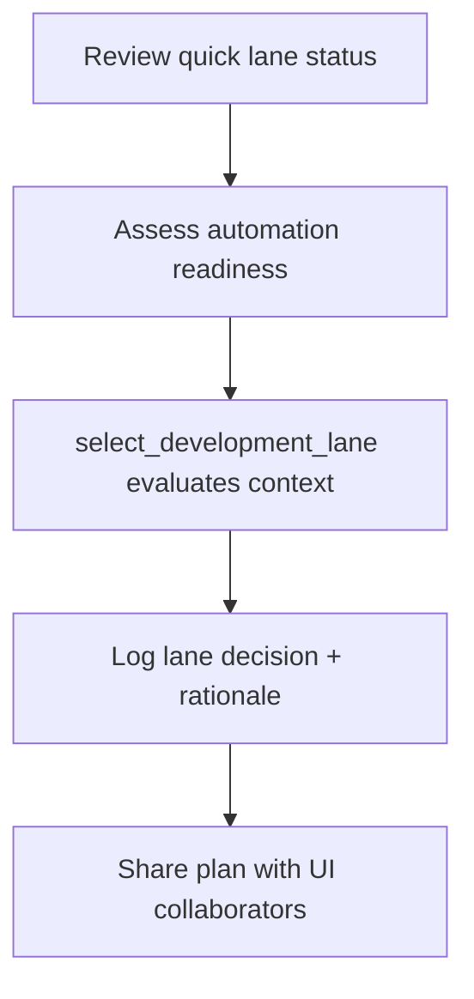

# UI Designer Persona Process Charts

## Persona 1 – Visual Mock Selection with the UI Designer Liaison

- Generate per-screen prompts from the agreed journey, save them to `docs/ui/ui-designer-screen-prompts.md`, and guide the user to run them in Gemini or other design tools.【F:dist/mcp/src/mcp-server/runtime.js†L2697-L2765】
- Optionally automate Gemini concept generation via Chrome MCP, capture screenshots, and loop back with analyze/refine/store steps as part of each iteration.【F:dist/mcp/src/mcp-server/runtime.js†L3327-L3455】【F:dist/mcp/src/mcp-server/runtime.js†L3021-L3238】
- Maintain a living `mockup.html` with selected variations to evolve the design system as choices are made.【F:dist/mcp/src/mcp-server/runtime.js†L3618-L3724】

```mermaid
graph TD
    A[Map screens with UI Designer Liaison] --> B[generate_ui_designer_prompts → screen prompts file]
    B --> C{Generate visuals?}
    C -->|Automated| D[automate_gemini_concepts via Chrome MCP]
    C -->|Manual| E[User runs prompts in Gemini]
    D --> F[analyze_gemini_concepts stores analysis]
    E --> F
    F --> G[refine_design_prompts (keep/avoid/adjust)]
    G --> H{Concept accepted?}
    H -->|No| B
    H -->|Yes| I[store_ui_iteration records decision]
    I --> J[update_mockup syncs design system]
```

## Persona 2 – Reference Collector Supplying Images & URLs

- Use Chrome MCP selectors to extract palettes, typography, spacing, and CSS variables from a reference URL, falling back to manual instructions if automation is unavailable.【F:dist/mcp/src/mcp-server/runtime.js†L2845-L2919】
- Persist evidence packs for reuse in later prompt generation, including manifest updates and token counts.【F:dist/mcp/src/mcp-server/runtime.js†L2930-L2993】
- Attach Gemini concept images and feedback to each iteration for downstream spec extraction and decision logging.【F:dist/mcp/src/mcp-server/runtime.js†L3021-L3238】
- Convert saved concept images into normalized component specs aligned with any existing design system constraints.【F:dist/mcp/src/mcp-server/runtime.js†L3489-L3598】


## Persona 3 – Journey Strategist Crafting Workflow Paths

- Run the optional `discover_ui_journey` step in the greenfield UI workflow to map journey stages before visual exploration.【F:aidesigner-core/workflows/greenfield-ui.yaml†L43-L51】
- Feed the captured journey into the UI designer prompt generator so each screen prompt reflects persona goals and purposes.【F:dist/mcp/src/mcp-server/runtime.js†L2697-L2742】
- Surface journey, CSS tokens, and validated concepts for downstream agents via the centralized UI context tool.【F:dist/mcp/src/mcp-server/runtime.js†L3277-L3305】

```mermaid
graph TD
    A[discover_ui_journey (conversation mapping)] --> B[Journey stored in project state]
    B --> C[generate_ui_designer_prompts uses journey]
    C --> D[Optional: automate/iterate on visuals]
    D --> E[store_ui_iteration captures validated concept]
    E --> F[get_ui_context exposes journey & design data to other agents]
```

## Persona 4 – Prompt Sprint Facilitator Running Nano Banana Briefs

- Spin up a Nano Banana prompt brief that bundles product details, journeys, and style guidance for Gemini exploration using `generate_nano_banana_prompts`.【F:dist/mcp/src/mcp-server/runtime.js†L1387-L1425】
- When the team wants hands-off rendering, trigger `automate_gemini_concepts` to submit the prompt pack and collect image outputs without leaving chat.【F:dist/mcp/src/mcp-server/runtime.js†L1606-L1627】
- Archive every run—including prompts, outputs, and qualitative notes—through `store_ui_iteration` so later collaborators can replay or fork the sprint history.【F:dist/mcp/src/mcp-server/runtime.js†L1559-L1593】



## Persona 5 – Chrome Automation Wrangler for Reference Capture

- Check whether Chrome DevTools MCP is ready with `check_chrome_mcp_available`, giving the designer a go/no-go signal for automated scraping.【F:dist/mcp/src/mcp-server/runtime.js†L1456-L1463】
- If missing, install the browser automation stack directly from chat by calling `install_mcp_server` with the Chrome server identifier.【F:dist/mcp/src/mcp-server/runtime.js†L1330-L1344】
- Run `extract_design_tokens_from_url` on inspiration sites to pull palettes, typography, and spacing into structured data.【F:dist/mcp/src/mcp-server/runtime.js†L1465-L1484】
- Persist those findings into reusable evidence packs via `store_design_evidence`, keeping provenance tied to each source URL.【F:dist/mcp/src/mcp-server/runtime.js†L1487-L1502】



## Persona 6 – Design System Librarian Synchronizing Tokens

- Pull curated evidence packs (including color, type, and spacing decisions) previously captured by `store_design_evidence` to seed the design system backlog.【F:dist/mcp/src/mcp-server/runtime.js†L1487-L1502】
- Push authoritative updates into the living `mockup.html` via `update_mockup`, ensuring new components and tokens become available to every reviewer instantly.【F:dist/mcp/src/mcp-server/runtime.js†L1654-L1682】
- Broadcast the refreshed system snapshot to downstream personas through `get_ui_context`, aligning architects, developers, and QA on the latest UI constraints.【F:dist/mcp/src/mcp-server/runtime.js†L1597-L1603】



## Persona 7 – UX Copy Harmonizer Refining Prompts

- Study the latest concept analysis via `analyze_gemini_concepts` to understand which storytelling elements resonated or fell flat.【F:dist/mcp/src/mcp-server/runtime.js†L1506-L1527】
- Adjust tone, hierarchy, and UI copy cues using `refine_design_prompts`, capturing keep/avoid lists and precise prompt tweaks.【F:dist/mcp/src/mcp-server/runtime.js†L1530-L1555】
- Register the updated narrative direction in `store_ui_iteration`, pairing new prompts with user feedback for future voice consistency checks.【F:dist/mcp/src/mcp-server/runtime.js†L1559-L1593】



## Persona 8 – Visual Specification Analyst Distilling Components

- Start from annotated concept sets and use `extract_design_specs_from_concepts` to transform imagery into normalized component specs.【F:dist/mcp/src/mcp-server/runtime.js†L1630-L1651】
- Apply the extracted specs to the shared mockup through `update_mockup`, keeping component variations synchronized with the canonical preview file.【F:dist/mcp/src/mcp-server/runtime.js†L1654-L1682】
- Surface the harmonized component inventory to other agents via `get_ui_context`, tying specs to journeys and validated decisions.【F:dist/mcp/src/mcp-server/runtime.js†L1597-L1603】



## Persona 9 – UX Review Gatekeeper for UI Checkpoints

- Invoke `run_review_checkpoint` to launch a formal reviewer agent that inspects design deliverables against tailored acceptance criteria.【F:dist/mcp/src/mcp-server/runtime.js†L1972-L2056】
- Capture the reviewer’s structured verdict—including risks and follow-up actions—directly in project state, providing an auditable trail for UI approvals.【F:dist/mcp/src/mcp-server/runtime.js†L1972-L2056】
- Feed approved artifacts back into the iteration log so subsequent personas know which visuals cleared governance.【F:dist/mcp/src/mcp-server/runtime.js†L1559-L1593】



## Persona 10 – Developer Handoff Coordinator Ensuring Build Readiness

- Aggregate journeys, tokens, and validated visuals with `get_ui_context` before involving implementation teams.【F:dist/mcp/src/mcp-server/runtime.js†L1597-L1603】
- Confirm the project is ready to shift into development by executing `transition_phase`, which enforces validation hooks when moving toward build work.【F:dist/mcp/src/mcp-server/runtime.js†L1741-L1772】
- Where required, run `run_story_context_validation` to certify story context completeness before code is written.【F:dist/mcp/src/mcp-server/runtime.js†L1800-L1809】



## Persona 11 – Project Memory Curator Resuming UI Workstreams

- Restore dormant sessions through `load_previous_state`, rehydrating prior journeys, prompts, and mockups for continuity.【F:dist/mcp/src/mcp-server/runtime.js†L2085-L2107】
- Immediately broadcast the refreshed artifacts by calling `get_ui_context`, enabling collaborators to pick up exactly where the team left off.【F:dist/mcp/src/mcp-server/runtime.js†L1597-L1603】
- Optionally log a new iteration with `store_ui_iteration` to document any catch-up adjustments applied after resuming the project.【F:dist/mcp/src/mcp-server/runtime.js†L1559-L1593】



## Persona 12 – Lane Strategist Balancing Quick vs Complex UI Execution

- Monitor the quick lane health flags within the orchestrator to know whether fast-path automation is safe to use for upcoming UI tasks.【F:dist/mcp/src/mcp-server/runtime.js†L805-L833】
- Use `select_development_lane` to weigh project scale, confidence, and prior deliverables, producing a logged recommendation for quick versus complex execution.【F:dist/mcp/src/mcp-server/runtime.js†L2121-L2174】
- Feed the lane decision back into planning conversations so UI stakeholders align on expected velocity and review cadence.【F:dist/mcp/src/mcp-server/runtime.js†L2121-L2174】


