# 🎨 AI Designer - Complete User Guide for Beginners

This comprehensive guide will help you understand and effectively use AI Designer for creating professional designs through AI-powered automation.

## 🚀 Quick Start for Absolute Beginners

### What is AI Designer?

AI Designer is like having a professional designer that works 24/7. You describe what you want, and it creates beautiful designs for you!

```mermaid
graph LR
    A[💭 Your Idea] --> B[🤖 AI Designer] --> C[✨ Beautiful Design]

    style A fill:#e3f2fd
    style B fill:#f3e5f5
    style C fill:#e8f5e8
```

### 5-Minute Quick Start

1. **Describe** what you want: "Create a logo for my coffee shop"
2. **Review** the AI's creation
3. **Refine** with feedback: "Make it more modern"
4. **Export** your final design
5. **Done!** Professional design ready to use

---

## 🎯 Complete AI Design Workflow

### The Magic Behind AI Designer

AI Designer follows a simple but powerful process that turns your ideas into professional designs:

```mermaid
graph TD
    A[💡 Your Creative Brief] --> B[🧠 AI Analysis Engine]
    B --> C[🎨 Design Generation]
    C --> D[👀 Your Review]
    D --> E{😊 Happy with it?}
    E -->|No| F[📝 Give Feedback]
    F --> G[🔄 AI Refinement]
    G --> C
    E -->|Yes| H[📤 Export & Use]
    H --> I[🎉 Professional Design Ready!]

    style A fill:#e1f5fe,stroke:#01579b,stroke-width:2px
    style B fill:#f3e5f5,stroke:#4a148c,stroke-width:2px
    style C fill:#e8f5e8,stroke:#1b5e20,stroke-width:2px
    style D fill:#fff3e0,stroke:#e65100,stroke-width:2px
    style E fill:#fce4ec,stroke:#880e4f,stroke-width:2px
    style H fill:#e0f2f1,stroke:#004d40,stroke-width:2px
    style I fill:#fff8e1,stroke:#f57f17,stroke-width:2px
```

### 📊 Success Rate by Iteration


## 🎨 Design Types & Examples

### What Can AI Designer Create?


### 📝 How to Write Perfect Design Briefs

#### ✅ GOOD Examples:

```
🎯 "Create a modern logo for 'TechFlow', a software company.
   Style: Clean, minimalist, tech-forward
   Colors: Blue (#2196F3) and white
   Usage: Website header, business cards, app icon
   Inspiration: Think Apple meets Microsoft"

🎯 "Design a landing page for 'GreenEats' meal delivery service.
   Target: Health-conscious millennials (25-35)
   Sections: Hero with app download, features, testimonials, pricing
   Style: Fresh, organic, trustworthy
   Colors: Green (#4CAF50), white, light gray"
```

#### ❌ BAD Examples:

```
❌ "Make a logo"
❌ "Design something cool"
❌ "Create a website for my business"
```

### 🎯 The Perfect Brief Formula


## 🔄 Step-by-Step Design Process

### Phase 1: Understanding Your Needs

```mermaid
graph TD
    A[💭 You Have an Idea] --> B[📝 Describe Your Vision]
    B --> C[🤖 AI Analyzes Requirements]
    C --> D[🎯 AI Asks Clarifying Questions]
    D --> E[✅ Requirements Confirmed]

    style A fill:#e1f5fe
    style B fill:#f3e5f5
    style C fill:#e8f5e8
    style D fill:#fff3e0
    style E fill:#c8e6c9
```

**Example Conversation:**

```
You: "I need a logo for my bakery"

AI: "Great! Let me understand your vision better:
     • What's your bakery's name?
     • What style appeals to you? (modern, vintage, playful, elegant)
     • Any specific colors you love?
     • Where will you use this logo? (storefront, packaging, website)"

You: "It's called 'Sweet Dreams Bakery', I love vintage style,
     warm colors like cream and brown, and I'll use it everywhere!"

AI: "Perfect! I'll create a vintage-style logo with warm, cozy colors
     that works great on signs, packaging, and digital platforms."
```

### Phase 2: Design Creation

```mermaid
graph TD
    A[🎨 AI Starts Creating] --> B[🧠 Analyzes Style Preferences]
    B --> C[🎨 Generates Color Palette]
    C --> D[✏️ Creates Typography]
    D --> E[🖼️ Assembles Design Elements]
    E --> F[✨ Final Design Generated]

    style A fill:#e8f5e8
    style B fill:#f3e5f5
    style C fill:#fff3e0
    style D fill:#e1f5fe
    style E fill:#fce4ec
    style F fill:#c8e6c9
```

**What Happens Behind the Scenes:**

1. **Style Analysis**: AI studies thousands of vintage bakery designs
2. **Color Selection**: Chooses warm, inviting colors that match your brief
3. **Typography**: Selects fonts that feel handcrafted and welcoming
4. **Composition**: Arranges elements for maximum visual impact
5. **Optimization**: Ensures it works at all sizes and formats

### Phase 3: Review & Refinement

```mermaid
graph TD
    A[👀 You Review the Design] --> B{😊 Love It?}
    B -->|Yes!| C[🎉 Perfect! Ready to Export]
    B -->|Almost...| D[📝 Give Specific Feedback]
    D --> E[🔄 AI Makes Adjustments]
    E --> F[👀 Review Updated Version]
    F --> B

    style A fill:#e3f2fd
    style B fill:#fff3e0
    style C fill:#c8e6c9
    style D fill:#f3e5f5
    style E fill:#e8f5e8
    style F fill:#fce4ec
```

## 💡 Real-World Examples

### Example 1: Coffee Shop Logo

#### The Brief:

```
"Create a logo for 'Morning Brew Coffee House'
- Style: Cozy, welcoming, artisanal
- Colors: Warm browns, cream, maybe a touch of green
- Usage: Storefront sign, coffee cups, website
- Vibe: Local neighborhood spot, not corporate chain"
```

#### AI's Process:


#### Result:

- Steam rising from coffee cup icon
- Hand-lettered "Morning Brew" text
- Warm brown (#8D6E63) and cream (#F5F5DC) colors
- Circular badge design that works on signs and cups

### Example 2: Tech Startup Website

#### The Brief:

```
"Design a landing page for 'CloudSync' - a file sharing app
- Target: Small business owners (30-50 years old)
- Goal: Get them to download the app
- Style: Professional but approachable, trustworthy
- Must include: Hero section, features, pricing, testimonials"
```

#### AI's Structure:

```mermaid
graph TD
    A[🎯 Hero Section] --> B[⭐ Key Features]
    B --> C[💰 Simple Pricing]
    C --> D[💬 Customer Stories]
    D --> E[📱 Download CTA]

    style A fill:#2196f3
    style B fill:#4caf50
    style C fill:#ff9800
    style D fill:#9c27b0
    style E fill:#f44336
```

#### Result:

- Clean hero with app screenshot and "Sync Your Files Anywhere" headline
- Three-column features section with icons
- Simple pricing table (Free/Pro/Business)
- Customer testimonials with photos
- Prominent download buttons for iOS/Android

## 🎨 Design Feedback That Works

### The Art of Giving Great Feedback

```mermaid
graph TD
    A[👀 Look at the Design] --> B[❤️ What Do You LOVE?]
    B --> C[🤔 What Needs Tweaking?]
    C --> D[📝 Be Specific]
    D --> E[🔄 AI Makes Changes]

    style A fill:#e3f2fd
    style B fill:#c8e6c9
    style C fill:#fff3e0
    style D fill:#f3e5f5
    style E fill:#e8f5e8
```

### ✅ GREAT Feedback Examples:

```
✅ "I love the overall layout and color scheme! Can you make the logo
   20% bigger and move it slightly to the left? Also, the headline
   font feels too formal - something more playful would be perfect."

✅ "The design is beautiful! The blue is perfect, but could we try
   a warmer shade of gray for the text? And maybe add a subtle
   shadow behind the main image?"

✅ "This is exactly the style I wanted! Just two small changes:
   1. Make the 'Contact Us' button more prominent (bigger/brighter)
   2. Can we try the logo in white instead of black?"
```

### ❌ Feedback That Doesn't Help:

```
❌ "I don't like it"
❌ "Make it better"
❌ "It needs more pop"
❌ "Something's off but I can't say what"
```

### 🎯 The Perfect Feedback Formula:

```mermaid
graph LR
    A[💚 Compliment] --> B[🎯 Specific Issue]
    B --> C[💡 Suggested Solution]
    C --> D[🔄 AI Implements]

    style A fill:#c8e6c9
    style B fill:#fff3e0
    style C fill:#e1f5fe
    style D fill:#f3e5f5
```

**Template:**

```
"I love [SPECIFIC THING YOU LIKE], but [SPECIFIC ISSUE].
Could you [SPECIFIC SOLUTION]?"
```

### 🚀 Advanced Feedback Techniques

#### Color Feedback:

```
✅ "Can you try a warmer blue? Maybe #4A90E2 instead?"
✅ "The green feels too bright - something more forest-like?"
❌ "Change the colors"
```

#### Layout Feedback:

```
✅ "Move the logo 50px to the right and make it 25% smaller"
✅ "The text feels cramped - can you add more white space?"
❌ "Fix the layout"
```

#### Typography Feedback:

```
✅ "Try a bolder font for the headline - maybe Montserrat Bold?"
✅ "The body text is hard to read - can you increase the size to 16px?"
❌ "Change the font"
```

## 🛠️ Troubleshooting Common Issues

### Issue 1: "AI doesn't understand my request"

```mermaid
graph TD
    A[❌ Vague Request] --> B[🔍 Add Details]
    B --> C[🎯 Specific Brief]
    C --> D[✅ Perfect Result]

    style A fill:#ffcdd2
    style B fill:#fff3e0
    style C fill:#e8f5e8
    style D fill:#c8e6c9
```

**Solution:** Be more specific about:

- Purpose/goal of the design
- Target audience
- Style preferences (modern, vintage, playful, etc.)
- Colors (specific hex codes or mood)
- Size/format requirements

### Issue 2: "Design doesn't match my vision"

**Problem:** Expecting the AI to read your mind
**Solution:** Use iterative refinement:

1. Identify specific elements to change
2. Provide reference examples if possible
3. Use design terminology
4. Be patient - great design takes iterations!

### Issue 3: "Colors look wrong on my screen"

**Problem:** Color perception differences between devices
**Solution:**

- Use specific color codes (hex: #FF5722, RGB: rgb(255, 87, 34))
- Test on multiple devices
- Consider your brand colors
- Ask for color variations to compare

## 📊 Performance & Quality Metrics

### ⏱️ Typical Generation Times:


### 🎯 Success Metrics:

- **First Attempt Satisfaction**: 70%
- **After 1 Iteration**: 85%
- **After 2-3 Iterations**: 95%
- **User Retention**: 90%

#### Momentum Snapshot (Executive Overview)

Every PRD generated with the core template now opens with a **Momentum Snapshot** table. This quick-read header is designed for executive reviews and daily stand-ups:

- 🎯 **Project Goal** — auto-filled from the latest Project Brief or documented decisions so the current north star is immediately visible.
- 🧑‍🤝‍🧑 **Primary Users** — pulls personas from the brief or any attached research to keep empathy front-and-center.
- 🚦 **Current Phase** — reflects where the product sits in the lifecycle based on recent approvals or the phase detector.
- ➡️ **Recommended Next Move** — identifies the single action that keeps momentum, citing the artifact or conversation that backs the recommendation.
- ⚠️ **Assumptions to Confirm** — clearly labels any guessed or missing data with “**Assumption – Needs Confirmation**,” helping reviewers decide what to validate first.

Before asking new questions, the PM agent cross-references the Project Brief, Decision Log, and other uploaded artifacts to pre-populate the snapshot. Any uncertainty is surfaced as an explicit assumption so stakeholders know exactly what requires confirmation.

#### Targeted Epic Specs (Next-Incomplete Focus)

- Run the Architect command `cmd tech-spec` whenever you're ready to advance an epic.
- The deliverable generator captures only the next incomplete epic and stores:
  - Structured JSON at `docs/epics/epic-<n>-<slug>.spec.json`
  - A readable summary at `docs/epics/epic-<n>-<slug>.spec.md`
- When you trigger `cmd auto-stories`, the Scrum Master lane reads the JSON spec and injects an **Epic Spec Context** section into the new story draft.
- Re-run the tech spec before starting a different epic to keep the context precise and avoid stale backlog assumptions.

### The Core Development Cycle (IDE)

Once planning is complete and documents are sharded, BMad follows a structured development workflow:


## Prerequisites

Before installing BMad Method, ensure you have:

- **Node.js** ≥ 18, **npm** ≥ 9
- **Git** installed and configured
- **(Optional)** VS Code with "Markdown All in One" + "Markdown Preview Mermaid Support" extensions

## Quality Assurance

**🏆 Perfect Production Quality**

AiDesigner maintains the highest code quality standards:

- **Zero Console Warnings** - All console.warn statements replaced with structured logging
- **Perfect Test Coverage** - 41/41 test suites pass, 230/230 individual tests pass
- **Flawless Build System** - All builds (agents, teams, MCP server) work perfectly
- **Professional Code Quality** - ESLint perfect score with 0 warnings
- **Production-Ready Logging** - Structured JSON logging throughout with proper error handling

This ensures a clean, professional development experience with zero technical debt.

## Installation

### Optional

If you want to do the planning on the web with Claude (Sonnet 4 or Opus), Gemini Gem (2.5 Pro), or Custom GPTs:

1. Navigate to `dist/teams/`
2. Copy `team-fullstack.txt`
3. Create new Gemini Gem or CustomGPT
4. Upload file with instructions: "Your critical operating instructions are attached, do not break character as directed"
5. Type `/help` to see available commands

### IDE Project Setup

```bash
# Interactive installation (recommended)
npx aidesigner install
```

### OpenCode

BMAD integrates with OpenCode via a project-level `opencode.jsonc`/`opencode.json` (JSON-only, no Markdown fallback).

- Installation:
  - Run `npx aidesigner install` and choose `OpenCode` in the IDE list.
  - The installer will detect an existing `opencode.jsonc`/`opencode.json` or create a minimal `opencode.jsonc` if missing.
  - It will:
    - Ensure `instructions` includes `.aidesigner-core/core-config.yaml` (and each selected expansion pack’s `config.yaml`).
    - Merge BMAD agents and commands using file references (`{file:./.aidesigner-core/...}`), idempotently.
    - Preserve other top-level fields and user-defined entries.

- Prefixes and collisions:
  - You can opt-in to prefix agent keys with `aidesigner-` and command keys with `/aidesigner:tasks:` to avoid name collisions.
  - If a key already exists and is not BMAD-managed, the installer will skip it and suggest enabling prefixes.

- What gets added:
  - `instructions`: `.aidesigner-core/core-config.yaml` plus any selected expansion pack `config.yaml` files.
  - `agent`: BMAD agents from core and selected packs.
    - `prompt`: `{file:./.aidesigner-core/agents/<id>.md}` (or pack path)
    - `mode`: `primary` for orchestrators, otherwise `all`
    - `tools`: `{ write: true, edit: true, bash: true }`
    - `description`: extracted from the agent’s `whenToUse`
  - `command`: BMAD tasks from core and selected packs.
    - `template`: `{file:./.aidesigner-core/tasks/<id>.md}` (or pack path)
    - `description`: extracted from the task’s “Purpose” section

- Selected Packages Only:
  - The installer includes agents and tasks only from the packages you selected in the earlier step (core and chosen packs).

- Refresh after changes:
  - Re-run:
    ```bash
    npx aidesigner install -f -i opencode
    ```
  - The installer safely updates entries without duplication and preserves your custom fields and comments.

- Optional convenience script:
  - You can add a script to your project’s `package.json` for quick refreshes:
    ```json
    {
      "scripts": {
        "/aidesigner:opencode": "aidesigner install -f -i opencode"
      }
    }
    ```

### Codex (CLI & Web)

BMAD integrates with OpenAI Codex via `AGENTS.md` and committed core agent files.

- Two installation modes:
  - Codex (local only): keeps `.aidesigner-core/` ignored for local dev.
    - `npx aidesigner install -f -i codex -d .`
  - Codex Web Enabled: ensures `.aidesigner-core/` is tracked so you can commit it for Codex Web.
    - `npx aidesigner install -f -i codex-web -d .`

- What gets generated:
  - `AGENTS.md` at the project root with a BMAD section containing
    - How-to-use with Codex (CLI & Web)
    - Agent Directory (Title, ID, When To Use)
    - Detailed per‑agent sections with source path, when-to-use, activation phrasing, and YAML
    - Tasks with quick usage notes
  - Optional shadcn UI support drops a `components.json` at the root using the
    canonical schema (`style`, `tailwind`, `aliases`, `typescript`, etc.) so the
    `shadcn` CLI can scaffold UI components without re-prompting you for
    preferences.
  - If a `package.json` exists, helpful scripts are added:
    - `/aidesigner:refresh`, `/aidesigner:list`, `/aidesigner:validate`
  - Global Codex CLI defaults are merged into `~/.codex/config.toml` (skipped automatically in CI/non-interactive runs).
    - Ensures aidesigner's MCP server is registered and Codex approvals run in fully automated mode by default.
    - Registers optional `chrome-devtools` and `shadcn` MCP helpers with
      `autoStart = false` so you can enable them post-install.
    - Resulting snippet:

      ```toml
      [cli]
      auto_approve_tools = true
      default_model = "GPT-5-Codex"
      require_manual_approval = false

      [mcp]
      auto_approve = true
      require_manual_approval = false

      [[mcp.servers]]
      args = ["aidesigner", "mcp"]
      autoApprove = true
      autoStart = true
      command = "npx"
      description = "aidesigner MCP server for orchestrating aidesigner agents."
      displayName = "aidesigner MCP"
      name = "bmad-mcp"
      transport = "stdio"

      [[mcp.servers]]
      args = ["@modelcontextprotocol/server-chrome-devtools@latest"]
      autoApprove = false
      autoStart = false
      command = "npx"
      description = "Optional Chrome DevTools recorder MCP server."
      displayName = "Chrome DevTools MCP"
      name = "chrome-devtools"
      transport = "stdio"

      [[mcp.servers]]
      args = ["@shadcn/ui-cli@latest", "mcp"]
      autoApprove = false
      autoStart = false
      command = "npx"
      description = "Optional shadcn UI MCP helper (works with generated components.json)."
      displayName = "shadcn UI MCP"
      name = "shadcn"
      transport = "stdio"
      ```

    - A copy of this config lives in `docs/codex-config.sample.toml` for reference.
    - Claude Code uses the JSON equivalent at `.claude/mcp-config.json`; optional
      servers appear with `"disabled": true` until you flip them on.

- Using Codex:
  - CLI: run `codex` in the project root and prompt naturally, e.g., “As dev, implement …”.
  - Web: commit `.aidesigner-core/` and `AGENTS.md`, then open the repo in Codex and prompt the same way.

- Refresh after changes:
  - Re-run the appropriate install mode (`codex` or `codex-web`) to update the BMAD block in `AGENTS.md`.

## Special Agents

There are two BMad agents — in the future they'll be consolidated into a single BMad-Master.

### BMad-Master

This agent can do any task or command that all other agents can do, aside from actual story implementation. Additionally, this agent can help explain the BMad Method when on the web by accessing the knowledge base and explaining anything to you about the process.

If you don't want to bother switching between different agents aside from the dev, this is the agent for you. Just remember that as the context grows, the performance of the agent degrades, therefore it is important to instruct the agent to compact the conversation and start a new conversation with the compacted conversation as the initial message. Do this often, preferably after each story is implemented.

### BMad-Orchestrator

This agent should NOT be used within the IDE, it is a heavyweight, special-purpose agent that utilizes a lot of context and can morph into any other agent. This exists solely to facilitate the teams within the web bundles. If you use a web bundle you will be greeted by the BMad Orchestrator.

### How Agents Work

#### Dependencies System

Each agent has a YAML section that defines its dependencies:

```yaml
dependencies:
  templates:
    - prd-template.md
    - user-story-template.md
  tasks:
    - create-doc.md
    - shard-doc.md
  data:
    - bmad-kb.md
```

**Key Points:**

- Agents only load resources they need (lean context)
- Dependencies are automatically resolved during bundling
- Resources are shared across agents to maintain consistency

#### Agent Interaction

**In IDE:**

```bash
# Some IDEs, like Cursor or Windsurf for example, utilize manual rules so interaction is done with the '@' symbol
@pm Create a PRD for a task management app
@architect Design the system architecture
@dev Implement the user authentication

# Some IDEs, like Claude Code, use slash commands instead
/pm Create user stories
/dev Fix the login bug
```

#### Interactive Modes

- **Incremental Mode**: Step-by-step with user input
- **YOLO Mode**: Rapid generation with minimal interaction

## IDE Integration

### IDE Best Practices

- **Context Management**: Keep relevant files only in context, keep files as lean and focused as necessary
- **Agent Selection**: Use appropriate agent for task
- **Iterative Development**: Work in small, focused tasks
- **File Organization**: Maintain clean project structure
- **Commit Regularly**: Save your work frequently

## The Test Architect (QA Agent)

### Overview

The QA agent in BMad is not just a "senior developer reviewer" - it's a **Test Architect** with deep expertise in test strategy, quality gates, and risk-based testing. Named Quinn, this agent provides advisory authority on quality matters while actively improving code when safe to do so.

#### Quick Start (Essential Commands)

```bash
@qa *risk {story}       # Assess risks before development
@qa *design {story}     # Create test strategy
@qa *trace {story}      # Verify test coverage during dev
@qa *nfr {story}        # Check quality attributes
@qa *review {story}     # Full assessment → writes gate
```

#### Command Aliases (Test Architect)

The documentation uses short forms for convenience. Both styles are valid:

```text
*risk    → *risk-profile
*design  → *test-design
*nfr     → *nfr-assess
*trace   → *trace-requirements (or just *trace)
*review  → *review
*gate    → *gate
```

### Core Capabilities

#### 1. Risk Profiling (`*risk`)

**When:** After story draft, before development begins (earliest intervention point)

Identifies and assesses implementation risks:

- **Categories**: Technical, Security, Performance, Data, Business, Operational
- **Scoring**: Probability × Impact analysis (1-9 scale)
- **Mitigation**: Specific strategies for each identified risk
- **Gate Impact**: Risks ≥9 trigger FAIL, ≥6 trigger CONCERNS (see `tasks/risk-profile.md` for authoritative rules)

#### 2. Test Design (`*design`)

**When:** After story draft, before development begins (guides what tests to write)

Creates comprehensive test strategies including:

- Test scenarios for each acceptance criterion
- Appropriate test level recommendations (unit vs integration vs E2E)
- Risk-based prioritization (P0/P1/P2)
- Test data requirements and mock strategies
- Execution strategies for CI/CD integration

**Example output:**

```yaml
test_summary:
  total: 24
  by_level:
    unit: 15
    integration: 7
    e2e: 2
  by_priority:
    P0: 8 # Must have - linked to critical risks
    P1: 10 # Should have - medium risks
    P2: 6 # Nice to have - low risks
```

#### 3. Requirements Tracing (`*trace`)

**When:** During development (mid-implementation checkpoint)

Maps requirements to test coverage:

- Documents which tests validate each acceptance criterion
- Uses Given-When-Then for clarity (documentation only, not BDD code)
- Identifies coverage gaps with severity ratings
- Creates traceability matrix for audit purposes

#### 4. NFR Assessment (`*nfr`)

**When:** During development or early review (validate quality attributes)

Validates non-functional requirements:

- **Core Four**: Security, Performance, Reliability, Maintainability
- **Evidence-Based**: Looks for actual implementation proof
- **Gate Integration**: NFR failures directly impact quality gates

#### 5. Comprehensive Test Architecture Review (`*review`)

**When:** After development complete, story marked "Ready for Review"

When you run `@qa *review {story}`, Quinn performs:

- **Requirements Traceability**: Maps every acceptance criterion to its validating tests
- **Test Level Analysis**: Ensures appropriate testing at unit, integration, and E2E levels
- **Coverage Assessment**: Identifies gaps and redundant test coverage
- **Active Refactoring**: Improves code quality directly when safe
- **Quality Gate Decision**: Issues PASS/CONCERNS/FAIL status based on findings

#### 6. Quality Gates (`*gate`)

**When:** After review fixes or when gate status needs updating

Manages quality gate decisions:

- **Deterministic Rules**: Clear criteria for PASS/CONCERNS/FAIL
- **Parallel Authority**: QA owns gate files in `docs/qa/gates/`
- **Advisory Nature**: Provides recommendations, not blocks
- **Waiver Support**: Documents accepted risks when needed

**Note:** Gates are advisory; teams choose their quality bar. WAIVED requires reason, approver, and expiry date. See `templates/qa-gate-tmpl.yaml` for schema and `tasks/review-story.md` (gate rules) and `tasks/risk-profile.md` for scoring.

### Working with the Test Architect

#### Integration with BMad Workflow

The Test Architect provides value throughout the entire development lifecycle. Here's when and how to leverage each capability:

| **Stage**          | **Command** | **When to Use**         | **Value**                  | **Output**                                                     |
| ------------------ | ----------- | ----------------------- | -------------------------- | -------------------------------------------------------------- |
| **Story Drafting** | `*risk`     | After SM drafts story   | Identify pitfalls early    | `docs/qa/assessments/{epic}.{story}-risk-{YYYYMMDD}.md`        |
|                    | `*design`   | After risk assessment   | Guide dev on test strategy | `docs/qa/assessments/{epic}.{story}-test-design-{YYYYMMDD}.md` |
| **Development**    | `*trace`    | Mid-implementation      | Verify test coverage       | `docs/qa/assessments/{epic}.{story}-trace-{YYYYMMDD}.md`       |
|                    | `*nfr`      | While building features | Catch quality issues early | `docs/qa/assessments/{epic}.{story}-nfr-{YYYYMMDD}.md`         |
| **Review**         | `*review`   | Story marked complete   | Full quality assessment    | QA Results in story + gate file                                |
| **Post-Review**    | `*gate`     | After fixing issues     | Update quality decision    | Updated `docs/qa/gates/{epic}.{story}-{slug}.yml`              |

#### Example Commands

```bash
# Planning Stage - Run these BEFORE development starts
@qa *risk {draft-story}     # What could go wrong?
@qa *design {draft-story}   # What tests should we write?

# Development Stage - Run these DURING coding
@qa *trace {story}          # Are we testing everything?
@qa *nfr {story}            # Are we meeting quality standards?

# Review Stage - Run when development complete
@qa *review {story}         # Comprehensive assessment + refactoring

# Post-Review - Run after addressing issues
@qa *gate {story}           # Update gate status
```

### Quality Standards Enforced

Quinn enforces these test quality principles:

- **No Flaky Tests**: Ensures reliability through proper async handling
- **No Hard Waits**: Dynamic waiting strategies only
- **Stateless & Parallel-Safe**: Tests run independently
- **Self-Cleaning**: Tests manage their own test data
- **Appropriate Test Levels**: Unit for logic, integration for interactions, E2E for journeys
- **Explicit Assertions**: Keep assertions in tests, not helpers

### Gate Status Meanings

- **PASS**: All critical requirements met, no blocking issues
- **CONCERNS**: Non-critical issues found, team should review
- **FAIL**: Critical issues that should be addressed (security risks, missing Paidesigner tests)
- **WAIVED**: Issues acknowledged but explicitly accepted by team

### Special Situations

**High-Risk Stories:**

- Always run `*risk` and `*design` before development starts
- Consider mid-development `*trace` and `*nfr` checkpoints

**Complex Integrations:**

- Run `*trace` during development to ensure all integration points tested
- Follow up with `*nfr` to validate performance across integrations

**Performance-Critical:**

- Run `*nfr` early and often during development
- Don't wait until review to discover performance issues

**Brownfield/Legacy Code:**

- Start with `*risk` to identify regression dangers
- Use `*review` with extra focus on backward compatibility

### Best Practices

- **Early Engagement**: Run `*design` and `*risk` during story drafting
- **Risk-Based Focus**: Let risk scores drive test prioritization
- **Iterative Improvement**: Use QA feedback to improve future stories
- **Gate Transparency**: Share gate decisions with the team
- **Continuous Learning**: QA documents patterns for team knowledge sharing
- **Brownfield Care**: Pay extra attention to regression risks in existing systems

### Output Paths Reference

Quick reference for where Test Architect outputs are stored:

```text
*risk-profile  → docs/qa/assessments/{epic}.{story}-risk-{YYYYMMDD}.md
*test-design   → docs/qa/assessments/{epic}.{story}-test-design-{YYYYMMDD}.md
*trace         → docs/qa/assessments/{epic}.{story}-trace-{YYYYMMDD}.md
*nfr-assess    → docs/qa/assessments/{epic}.{story}-nfr-{YYYYMMDD}.md
*review        → QA Results section in story + gate file reference
*gate          → docs/qa/gates/{epic}.{story}-{slug}.yml
```

## Technical Preferences System

BMad includes a personalization system through the `technical-preferences.md` file located in `.aidesigner-core/data/` - this can help bias the PM and Architect to recommend your preferences for design patterns, technology selection, or anything else you would like to put in here.

### Using with Web Bundles

When creating custom web bundles or uploading to AI platforms, include your `technical-preferences.md` content to ensure agents have your preferences from the start of any conversation.

## Core Configuration

The `.aidesigner-core/core-config.yaml` file is a critical config that enables BMad to work seamlessly with differing project structures, more options will be made available in the future. Currently the most important is the devLoadAlwaysFiles list section in the yaml.

### Developer Context Files

Define which files the dev agent should always load:

```yaml
devLoadAlwaysFiles:
  - docs/architecture/coding-standards.md
  - docs/architecture/tech-stack.md
  - docs/architecture/project-structure.md
```

You will want to verify from sharding your architecture that these documents exist, that they are as lean as possible, and contain exactly the information you want your dev agent to ALWAYS load into its context. These are the rules the agent will follow.

As your project grows and the code starts to build consistent patterns, coding standards should be reduced to include only the standards the agent still needs enforced. The agent will look at surrounding code in files to infer the coding standards that are relevant to the current task.

## Drawbridge Visual Feedback Integration

AiDesigner can ingest Drawbridge exports to align visual annotations with orchestrator workflows.

1. Export feedback from Drawbridge (ensure `moat-tasks-detail.json`, `moat-tasks.md`, and `/screenshots` are included).
2. Run `node tools/drawbridge-context-pack.mjs --input <export-path> --mode batch` (or `step`/`yolo`) from the project root.
   - The utility copies screenshots into `.aidesigner/drawbridge/context-packs/`, updates project state, and refreshes documentation markers in `docs/prd.md` and `docs/implementation/drawbridge-visual-feedback.md`.
3. Review the queue with `npx aidesigner review` (supports `--include-resolved` for historical context).
4. Work through the checklist in `docs/qa/gates/drawbridge-review.md` before closing the gate.
5. Reference the generated pack ID in follow-up commits or stories so traceability links remain intact.

## 📤 Export & File Formats

### Available Export Formats

```mermaid
graph TD
    A[✨ Your Final Design] --> B[🖼️ Images]
    A --> C[📄 Documents]
    A --> D[💻 Web Files]

    B --> B1[PNG - High Quality]
    B --> B2[JPG - Smaller Size]
    B --> B3[SVG - Scalable Vector]

    C --> C1[PDF - Print Ready]
    C --> C2[AI/EPS - Professional]

    D --> D1[HTML - Web Pages]
    D --> D2[CSS - Styling]
    D --> D3[React - Components]

    style A fill:#e1f5fe
    style B fill:#e8f5e8
    style C fill:#fff3e0
    style D fill:#f3e5f5
```

### Export Quality Guide

| Format   | Best For           | Quality | File Size |
| -------- | ------------------ | ------- | --------- |
| **PNG**  | Web, presentations | High    | Medium    |
| **JPG**  | Photos, web        | Good    | Small     |
| **SVG**  | Logos, icons       | Perfect | Tiny      |
| **PDF**  | Print, documents   | Perfect | Medium    |
| **HTML** | Websites           | Perfect | Small     |

### 🎯 Quick Export Tips:

- **Logos**: Use SVG for scalability
- **Web**: PNG for images, HTML for pages
- **Print**: PDF at 300 DPI minimum
- **Social Media**: JPG for photos, PNG for graphics

## 🚀 Getting Started Checklist

### Your First Design in 10 Minutes:

```mermaid
graph TD
    A[✅ 1. Open AI Designer] --> B[✅ 2. Write Your Brief]
    B --> C[✅ 3. Review First Draft]
    C --> D[✅ 4. Give Feedback]
    D --> E[✅ 5. Export Final Design]

    style A fill:#c8e6c9
    style B fill:#c8e6c9
    style C fill:#c8e6c9
    style D fill:#c8e6c9
    style E fill:#c8e6c9
```

### ✅ Pre-Flight Checklist:

- [ ] I know what I want to create
- [ ] I have my brand colors (if applicable)
- [ ] I know where I'll use this design
- [ ] I'm ready to give specific feedback
- [ ] I have 10-15 minutes to iterate

### 🎓 Learning Path:

#### Week 1 - Beginner:

- [ ] Create your first logo
- [ ] Try 3 different styles
- [ ] Learn basic feedback techniques
- [ ] Export in multiple formats

#### Week 2-3 - Intermediate:

- [ ] Design a complete brand identity
- [ ] Create a multi-page website
- [ ] Use advanced prompting techniques
- [ ] Implement brand guidelines

#### Month 1+ - Advanced:

- [ ] Batch processing workflows
- [ ] API integration
- [ ] Custom style development
- [ ] Team collaboration features

## 🤝 Community & Support

### Getting Help:

1. **📚 Documentation**: Check this guide first
2. **🎨 Examples Gallery**: Browse successful projects
3. **💬 Community Forum**: Ask questions and share tips
4. **🎫 Support Tickets**: Technical issues
5. **📺 Video Tutorials**: Visual learning resources

### 🌟 Success Stories:

#### Case Study 1: Startup Branding

```
Challenge: Complete brand identity in 2 days
Solution: AI Designer + iterative refinement
Result: Logo, business cards, website, social media kit
Time Saved: 2 weeks of traditional design work
```

#### Case Study 2: E-commerce Store

```
Challenge: Product page designs for 100+ items
Solution: Batch processing with brand templates
Result: Consistent, professional product pages
Time Saved: 3 months of manual design work
```

## 📝 Quick Reference Card

### Essential Commands:

```bash
npm start              # Start the application
npm run generate       # CLI generation mode
npm run export         # Batch export designs
npm run debug         # Enable debug mode
```

### Key Shortcuts:

```
Ctrl/Cmd + G          # Generate new design
Ctrl/Cmd + R          # Regenerate current
Ctrl/Cmd + E          # Export current design
Ctrl/Cmd + Z          # Undo last change
Ctrl/Cmd + Y          # Redo change
```

### Perfect Brief Template:

```
"Create a [TYPE] for '[NAME]'
- Style: [MODERN/VINTAGE/PLAYFUL/ELEGANT]
- Colors: [SPECIFIC COLORS OR MOOD]
- Usage: [WHERE WILL IT BE USED]
- Target: [WHO IS YOUR AUDIENCE]
- Inspiration: [REFERENCE EXAMPLES]"
```

---

## 🎉 Ready to Create Amazing Designs?

**Congratulations!** You now have everything you need to create professional designs with AI Designer. Remember:

- **Start simple** - your first design doesn't need to be perfect
- **Be specific** - detailed briefs get better results
- **Iterate freely** - great design happens through refinement
- **Have fun** - creativity should be enjoyable!

### 🚀 Start Your First Design Now:

1. Open AI Designer
2. Use this template: _"Create a logo for my [BUSINESS TYPE] called '[NAME]' with a [STYLE] feel"_
3. Follow the feedback tips from this guide
4. Export and use your professional design!

**Happy Designing! 🎨✨**

---

_This guide is continuously updated based on user feedback and new features. For the latest version, visit our documentation._
