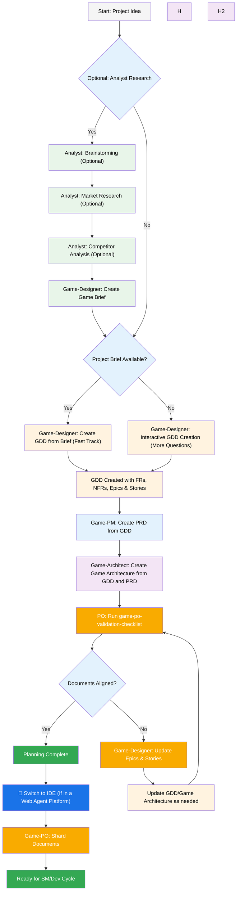
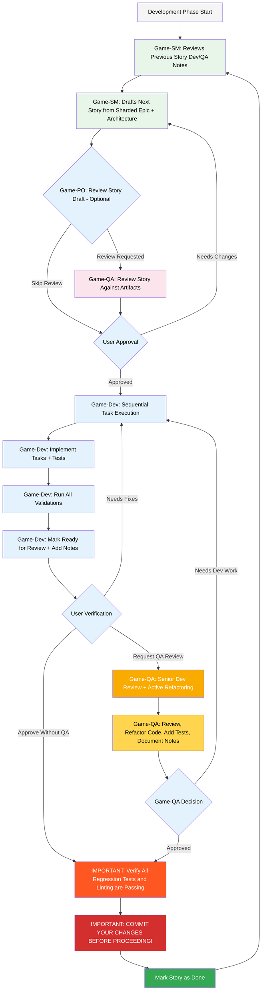

# Agilai Godot Game Development Expansion Pack Guide

The Agilai Godot Game Development expansion pack brings BMAD-METHOD™ multi-agent workflows directly into your game projects. It layers Godot-specific playbooks, tasks, and templates on top of the core Agilai orchestration so you can move from concept to implementation without leaving your IDE.

> **Note on legacy naming:** The on-disk folders for this expansion still carry the historical `bmad-` prefix (for example `.bmad-godot-game-dev/`). These names remain in place for compatibility with existing agent bundles and CLI manifests. All usage guidance below assumes the current Agilai CLI while calling out the legacy paths when they are required verbatim.

## Agilai Planning and Execution Workflow

**We follow the standard Agilai plan → build loop, tailoring the steps to Godot development.** The diagrams below mirror the production workflow that ships with Agilai 1.3.x.

### Planning Workflow (Web UI or Agentic IDE)

Before touching code, Agilai encourages a structured planning flow. Run it in the web UI for cost-efficient ideation, or inside an agentic IDE if you already have the expansion installed locally.



#### Web UI to IDE Transition

**Critical Transition Point:** Once the Product Owner confirms document alignment, switch from the web UI to your IDE to start development:

1. **Copy Documents to Project:** Place `docs/gdd.md` and `docs/gamearchitecture.md` into your project docs folder (or specify a custom location during installation).
2. **Switch to IDE:** Open the repository in your preferred agentic IDE.
3. **Document Sharding:** Ask the Game Designer agent to shard the GDD, then instruct the Game Architect to shard `gamearchitecture.md`.
4. **Begin Development:** Move into the core development cycle below.

### Core Development Cycle (IDE)

Once planning is complete and the documents are sharded, Agilai follows a structured development workflow:



## Installation

### Optional: Preparing Web Bundles

If you prefer to run the planning flow in the browser using Claude, Gemini, or a Custom GPT:

1. Navigate to `dist/expansion-packs/bmad-godot-game-dev/teams`.
2. Copy the contents of `godot-game-dev.txt`.
3. Create a new Gemini Gem or Custom GPT and upload the file with the instruction: "Your critical operating instructions are attached; stay in character as directed."
4. Type `/help` in the web interface to see the available commands.

### IDE Project Setup with the Agilai CLI

Use the production CLI to install Agilai and the Godot expansion pack locally. The recommended one-liner performs initialization, dependency installation, and assistant launch prompts:

```bash
# Interactive installation (recommended)
npx agilai@latest start
```

If you are developing directly from a local checkout of this repository, you can run the same workflow without npm registry access:

```bash
node bin/agilai start
```

Both entry points were validated against Agilai CLI **v1.3.11**. The local command surfaces the same interactive assistant selection prompt as the published package.

## Special Agents

The expansion packs ships with the full Godot game-delivery team plus a heavyweight orchestrator for web bundles.

### Agilai Orchestrator (legacy file name: `agents/bmad-orchestrator.md`)

- Acts as the web bundle conductor and can assume any specialized role on demand.
- Uses larger context windows and should stay in the browser to avoid overwhelming IDE-based CLIs.
- Keep this agent as the entry point for fully automated planning sessions.

### Core Game Team Agents

Within the IDE you will primarily collaborate with:

- `game-analyst` – research, discovery, competitor sweeps
- `game-designer` – vision, GDD creation, quest/level design
- `game-pm` / `game-po` – product planning, PRD creation, backlog validation
- `game-architect` – architecture, technical spikes, sharding
- `game-sm` – story slicing, sprint orchestration
- `game-developer` – implementation guidance and task execution
- `game-qa` – validation, refactoring, test reinforcement
- `game-ux-expert` – UX heuristics, accessibility, usability reviews

Each markdown file in `agents/` defines persona, goals, and dependencies that the CLI loads dynamically.

## How Agent Dependencies Work

Agents declare their supporting files in YAML to keep context lean while guaranteeing reproducible operations:

```yaml
dependencies:
  templates:
    - prd-template.md
    - user-story-template.md
  tasks:
    - create-doc.md
    - shard-doc.md
  data:
    - bmad-kb.md
```

**Key points:**

- Agents load only the resources they need when commands require them.
- Dependencies are resolved automatically when you run commands via Agilai.
- Resources are shared across agents to keep terminology consistent.

## Agent Interaction Patterns

### Inside Agentic IDEs

```bash
# Cursor, Windsurf, and similar IDEs use manual rules with the '@' prefix
@game-designer Create a GDD for a task management app
@game-architect Design the game architecture
@game-developer Implement the user authentication

# Claude Code and other slash-based CLIs
/game-sm Create user stories
/game-developer Fix the login bug
```

### Interactive Modes

- **Incremental Mode:** Step-by-step collaboration with frequent checkpoints.
- **YOLO Mode:** Rapid generation with minimal prompts—best when you already trust the agent’s direction.

## IDE Integration Best Practices

- **Context Management:** Keep only the most relevant files in the working set; trim documents aggressively after sharding.
- **Agent Selection:** Pick the specialist that matches the current activity (designer vs. architect vs. dev, etc.).
- **Iterative Delivery:** Break features into focused slices so validation cycles stay fast.
- **File Organization:** Maintain a clean project structure to make sharding and always-load lists predictable.

## Technical Preferences System

Personalize Agilai’s recommendations by editing `technical-preferences.md` under `.bmad-godot-game-dev/data/`. Although the directory retains the legacy prefix, the CLI automatically locates the file. Populate it with preferred design patterns, third-party services, or Godot-specific conventions.

When you build custom web bundles or upload instructions to hosted AI platforms, include the same content so your preferences influence every conversation from the first prompt.

## Core Configuration

Agilai stores shared configuration in `.agilai-core/core-config.yaml`. The Godot expansion also looks for `.bmad-godot-game-dev/config.yaml` (legacy name retained for compatibility). Copy the `core-config.yaml.example` shipped with the expansion into both locations, then update at least the `gameDimension` value to match your project.

### Developer Always-Load Context

Define the files the developer agent should always pull into context:

```yaml
devLoadAlwaysFiles:
  - docs/architecture/##-coding-standards.md
  - docs/architecture/##-tech-stack.md
  - docs/architecture/##-godot-project-structure.md
```

Replace `##` with the prefix generated during sharding, and keep these documents lean so the developer agent receives concise, enforceable guidance.

## Validation Status

- ✅ `node bin/agilai help` confirms Agilai CLI v1.3.11 exposes the `start` command used above and documents the supported flags.
- ✅ `node bin/agilai start` (interrupted after the assistant prompt) demonstrates the local workflow launches with the same assistant selection flow as the published package.

These checks ensure the instructions above work end-to-end with the current Agilai CLI. Update screenshots or command snippets in your project documentation if the CLI output changes in future releases.

## Getting Help

- **Discord Community:** [Join the Agilai/BMAD community](https://discord.gg/gk8jAdXWmj) for real-time support.
- **GitHub Issues:** [Report bugs](https://github.com/bmadcode/bmad-method/issues) and track fixes.
- **Documentation:** [Browse the Agilai docs](https://github.com/bacoco/Agilai/tree/main/docs) for deeper architectural details.
- **YouTube:** [BMadCode Channel](https://www.youtube.com/@BMadCode) for walkthroughs and release updates.

## Conclusion

Agilai’s Godot expansion accelerates your game delivery pipeline by pairing BMAD-METHOD™ best practices with domain expertise. Use it to orchestrate disciplined planning, keep execution aligned with your GDD, and maintain quality across every sprint—all while staying in natural conversation with specialized agents.
